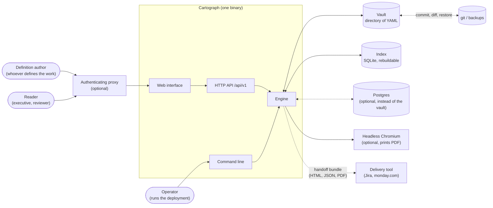
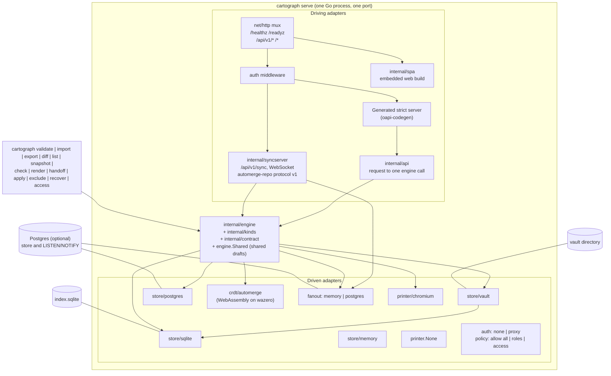
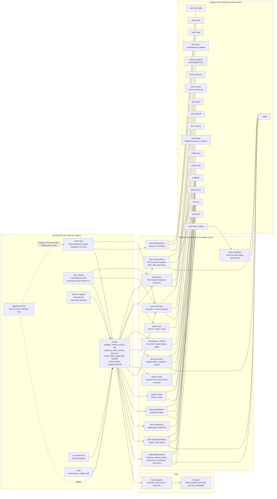
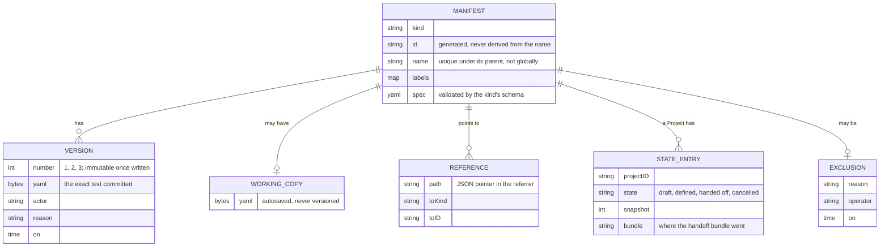
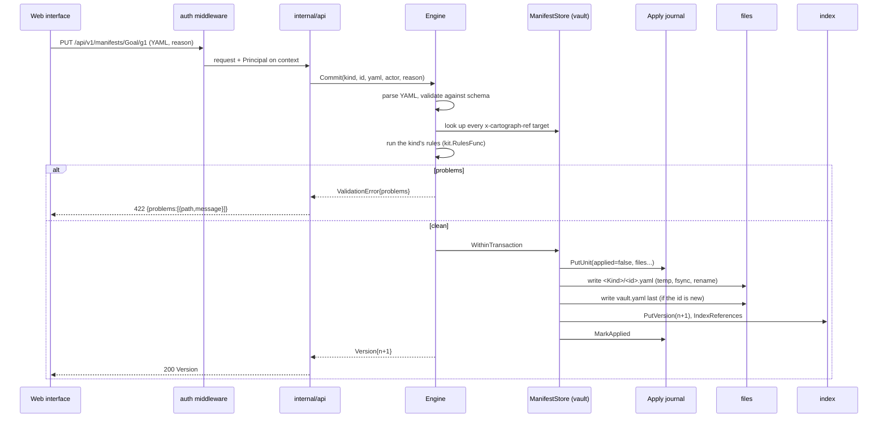
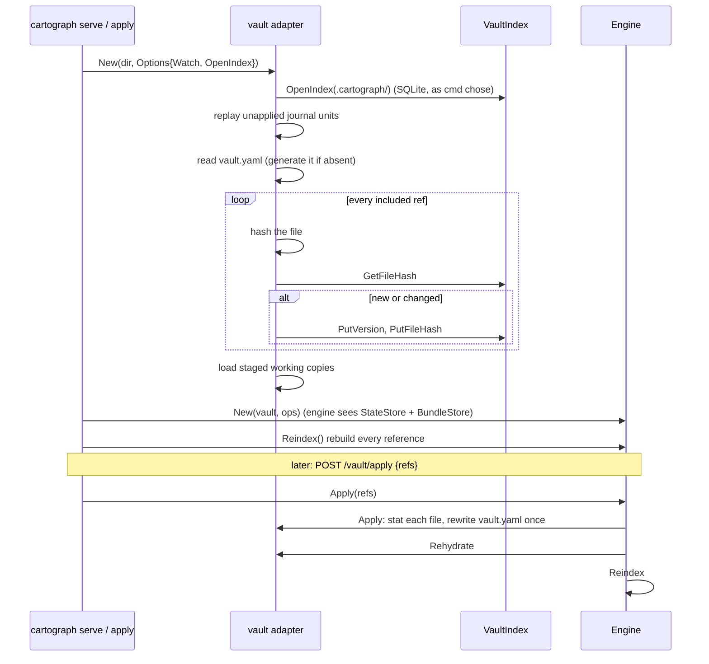
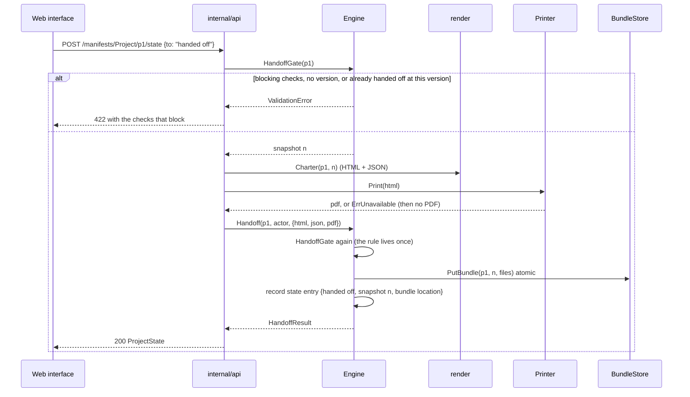
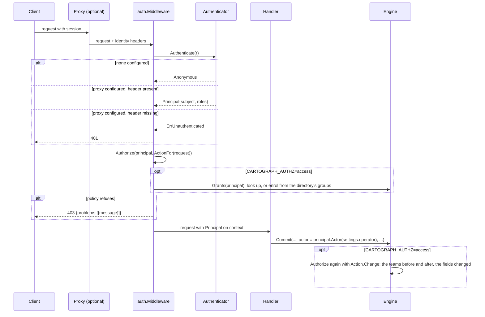
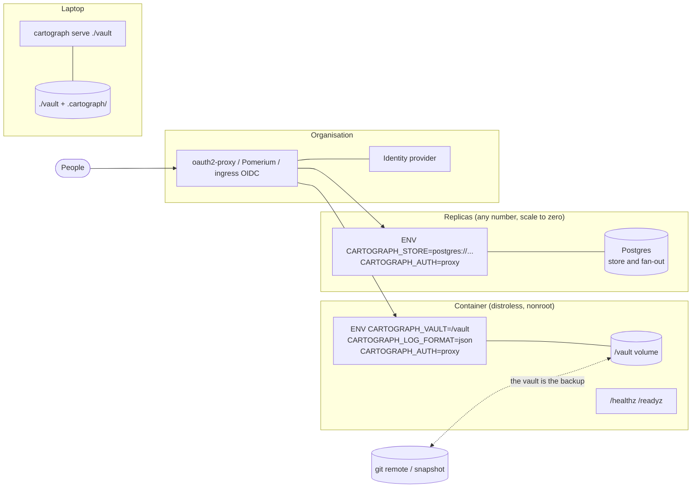

# Cartograph systems architecture

This describes the tree as built, at engine 2.5.0. Where it shows a
port with one adapter, that is how things stand today, and nothing
more. Each decision behind it has its own file in
[`adr/`](adr/README.md).

Cartograph captures what an organisation has decided to do (goals, programmes,
projects, operations, KPIs, the data sources behind them) as declarative
manifests, checks them against a contract and a set of discipline rules,
and renders the result as documents other tools and people consume.
It does not manage delivery. Jira, or whatever the organisation runs,
does that. Cartograph hands a defined project over and keeps the record.

Three decisions shape everything below.

1. **Contract first.** `contract/openapi.yaml` and one JSON Schema per
   kind are the source of truth. The Go server types and the TypeScript
   client are generated from them and committed; CI fails on drift. No
   handwritten request or response type exists.
2. **The record is the committed text of each version, in whatever
   store the deployment chose.** The engine holds no file path and no
   syntax. A `ManifestStore` adapter keeps the text, and a `Codec`
   adapter says what the text is written in. The reference adapter, the vault,
   makes that record a directory of files, one per manifest, plus
   `vault.yaml` saying which are live, so a vault can be read with
   `cat`, diffed with git, and edited in any editor while the server is
   running. Its index (versions, references, summaries) is a cache that
   can be deleted and rebuilt. A database adapter keeps the same record
   as rows, and the engine cannot tell the difference. "Files are the
   truth" is the vault's promise, not the architecture's.
3. **One engine, many adapters.** Every rule lives in the Go engine, which
   talks to the world through interfaces (ports). Files, SQLite,
   Postgres, a browser that prints PDFs and an authenticating proxy are
   all adapters, and a deployment picks each by configuration. The HTTP
   API and the command line are two front doors to the same engine. The
   web interface is a client of the API and its sync socket, nothing
   more.

## 1. Context



With a vault, the vault is the only thing that needs backing up, and
`git` is a fine way to do it. The index lives beside the vault under
`.cartograph/` and is ignored by version control. With a Postgres store
(`CARTOGRAPH_STORE`), the database holds everything instead, and its
own backups are the backup. The proxy and the browser are optional. A
single operator on a laptop runs `cartograph serve .` and gets
everything except PDF printing and identity.

## 2. Containers

A deployment is one process, or several identical replicas of it
against one Postgres database. The pieces inside a process are
separable, and the command line proves it: every subcommand opens the
same engine over the same adapters without an HTTP server in the way.



The web interface is built with Vite in `cartograph-ui` and embedded
into the binary with `go:embed`, so a deployment ships one file. The
engine embeds a released build, not a source tree: `UI_VERSION` names
the release and `UI_SHA256` pins its bytes, and `just ui` and the flake
both unpack exactly that into `internal/spa/dist` before compiling
(ADR 0002). The interface talks only to `/api/v1`, through one HTTP
adapter generated from the same OpenAPI document the server is
generated from, which is how the two halves stay in step. Live editing
and presence go over the sync socket at `/api/v1/sync`, behind the same
authentication and authorization, with the stock automerge-repo
WebSocket adapter (ADR 0007).

## 3. The hexagon

The engine depends on nothing but ports. This is the diagram to keep in
mind when adding anything: if a new feature needs the engine to know
about a file path, a SQL dialect or an HTTP header, it needs a port.



A few things the diagram cannot say.

The ports are small and typed on plain values (`[]byte` of YAML, strings,
times). An adapter never sees an engine type, so it could move to
another module without the engine noticing.

The ports do not assume calls are free. Wherever the engine needs many
manifests at once (a goal tree, a rule that reads a whole kind, a page
of a list), it asks for the set in one call, through optional
interfaces beside `ManifestStore` (`store.SetReader` and its kin), and
loops only over a store that lacks them. So each adapter is built for
its own engine: the vault answers from memory, Postgres from one query
over a row per manifest (ADR 0012).

Each thing a store keeps is copy-on-write or merge-on-read, and ADR
0013 says which and why: the current definitions are written whole at a
save, because everything reads them; history, series items, events and
reports are appended or computed and combined when read, because they
are read far less than they are written. Every backend offers every
function, the vault included, and the build stays one static binary.

`StateStore` and `BundleStore` are optional. The engine attaches them when
the manifest store happens to implement them (the vault does) or when the
composition root passes them as options. A store without an apply gate,
such as a database where every row is live, answers `ErrNoState`, and the
API turns that into an empty list or a refusal. That is the whole
difference between "define in YAML" and "define in a database" as far as
the engine is concerned.

The identity ports sit on the driving side on purpose. The engine takes an
actor string and records it on every version and state transition. It
does not know what a session is. Two middlewares wrap the whole API, in
order: `auth.Middleware` turns the request into a `Principal` (or answers
401), and `auth.Authorize` classifies the request into an `Action` (read
or write, and the manifest it names) and puts it to the `Authorizer` (or
answers 403). The handlers never see a credential and never decide
policy. They take the actor off the context. So identity stays out of
the core, and a deployment can run with no identity on a trusted
network, trust a proxy's header with readers and editors by group, or
keep an access list of people, roles and teams behind an OIDC proxy,
all without changing the engine.

A policy that decides by a manifest's content cannot decide at the
middleware, which never sees the content. So the engine asks the same
`Authorizer` again at every write, with what the write does: the
chains of teams the manifest sits under before and after, and the spec
fields it changes (ADR 0011). That is why the engine imports
`internal/identity`, the HTTP-free half of the identity port (the
principal on the context, the action, the authorizer). `internal/auth`
adds the HTTP half and re-exports the rest. The engine still never
sees a credential or a session.

The access list is the one piece of identity the engine stores, behind
`store.AccessStore`, in the same database as everything else. The
access policy asks the engine what a principal holds (`Engine.Grants`),
and the engine answers from the list, merging in what the directory's
groups give through the deployment's mapping. A person whose groups
grant a role is put on the list at their first sign-in. People are
principals, not manifests (TAXONOMY.md D27); teams are manifests, the
`Team` kind, so the mapping creates them like any other definition.

`codec.Codec` is the one port the engine owns for its own input: manifest
text in, document out, and canonical text back for a save. The engine
parses no syntax itself. Vaults are written in YAML. The JSON adapter
proves the seam, and it is the natural syntax for a database-backed
deployment. A store keeps the text its codec produced, byte for byte,
so versions and diffs are over what the person wrote. Changing the
codec of an existing vault is therefore a migration (`cartograph export
--codec json`, then serve the export with `CARTOGRAPH_CODEC=json`), and
never a flag flipped on live files.

`VaultIndex` is the vault adapter's own port, one layer down. The vault
is files plus a rebuildable cache, and that cache is SQLite today. The
engine does not see this port at all. Nor does the vault choose its
adapter; the composition root passes an opener
(`vault.Options.OpenIndex`), so the vault and SQLite adapters never
import each other (ADR 0004).

`pkg/client.Client` is the port on the other side, the one an interface
(web, terminal, a bot) uses. It is a Go interface, never a wire format.
In one process it is the engine (`inproc`). Across a process boundary it
is a transport adapter (`remote`, the HTTP contract over TCP or a UNIX
socket, which SSH forwards). The HTTP API in `internal/api` is the far
end of that transport, not something an interface talks to directly.
Both transports are proven by the same conformance suite
(`pkg/uiconformance`), which is how a new transport is admitted.
`UI_CONTRACT.md` and `MULTIPLAYER.md` are the design of record for the
interfaces and for shared editing.

Shared editing has four pieces on the engine's side (ADR 0007, ADR 0008).
`engine.Shared` is the shared-draft service: one Automerge document per
manifest, reached through the `crdt.Engine` port, whose one adapter
runs Automerge compiled to WebAssembly on wazero, so the binary stays
free of cgo. `store.DocStore` keeps each document as a snapshot plus
the chunks appended since, in memory, in SQLite (the vault's index) or
in Postgres. `fanout.Bus` carries "this document changed" and presence
from one replica to the others, as hints that correctness never
depends on. The sync socket, `internal/syncserver`, is a driving
adapter beside the HTTP API: it speaks the automerge-repo network
protocol to interfaces and turns each message into a call on
`engine.Shared`. Live edits and presence travel there. The client port
only names a manifest's document (`SharedDocument`). `engine.Bus` is
what is left of the old event bus, carrying versions saved and states
changed within one process.

### 3.1 Clean architecture, and the test that keeps it

The hexagon above is clean architecture drawn from the side. Here it is
as rings, from the centre out.

| Ring | Here | May depend on |
|---|---|---|
| Entities | `internal/kinds`, `kinds/<kind>` and `kinds/kit` (what a kind is, its rules), `internal/contract` (the schemas and flows), `internal/sentence` | nothing in the module but each other; no driver |
| Use cases | `internal/engine` | the ports and the entities |
| Ports | `internal/store` (with `store.DocStore` and `store.AccessStore`), `internal/codec`, `internal/printer`, `internal/layout`, `internal/crdt`, `internal/fanout`, `engine.Bus` (driven); `pkg/client`, `pkg/uiconformance`, `internal/identity`, `internal/auth` (driving) | the entities; `internal/identity` nothing at all; `internal/auth` also `net/http`, because the identity ports are request middleware, and `internal/identity` |
| Interface adapters | driving: `internal/api`, `internal/syncserver`, `internal/render`, `internal/spa`, `pkg/client/inproc`, `pkg/client/remote`, `uiconformance/clientdriver`; driven: `store/vault`, `store/sqlite`, `store/memory`, `store/postgres`, `crdt/automerge`, `fanout/memory`, `fanout/postgres`, `codec/yaml`, `codec/json`, `printer/chromium`, `layout/force`, `auth/proxy`, `auth/roles`, `auth/access`, the conformance suites, and the helpers the adapters share (`yamlfmt`, `store/manifestmeta`) | the rings inside them, never another adapter of their side |
| Frameworks and drivers | `net/http`, `database/sql`, `os/exec`, `modernc.org/sqlite`, `pgx` (only in the Postgres adapters), `wazero` (only in the Automerge adapter), `fsnotify`, `yaml.v3`, Chromium, the generated server (`api/gen`) | used only by adapters |
| Composition root | `cmd/cartograph`, `internal/config` | everything; the one place an adapter is chosen |

The dependency rule (dependencies point inward) is a test,
`internal/arch`, run by `just arch` and in the gate. Every package in
the module has a rule there, and a new package without one fails the
build, so nothing joins the tree without somebody saying which ring it
belongs to. Each rule lists what that package must never depend on,
transitively: module packages by subtree, third-party drivers by
module path, and standard-library drivers (`net/http`, `database/sql`,
`os/exec`) by name. In short:

- the engine may not import an adapter, a driver or a syntax library;
- a port may not import the engine;
- an adapter may not import another adapter, because composing
  adapters is the root's job;
- the entities, `internal/identity` and the ports `internal/codec`,
  `internal/printer`, `internal/crdt` and `internal/fanout` may not
  import anything else in the module;
- `cmd` is the only package that knows everything, which is what makes
  it the one place an adapter is chosen.

A change that needs a new edge gets a new port, not an exception
(ADR 0003).

### 3.2 Packages

| Package | Role | Depends on |
|---|---|---|
| `internal/contract` | The JSON Schema and flow files, embedded; the schema set | nothing |
| `internal/sentence` | Composes the sentences a manifest stores in parts, the same way everywhere they are shown | nothing |
| `internal/kinds`, `internal/kinds/<kind>` | The registry of kinds and each kind's rules beyond its schema | `kinds/kit` |
| `internal/kinds/kit` | The small types rules need (`Problem`, `Lookup`) so kind packages never import the engine | nothing |
| `internal/engine` | The core: validation, commits, versions, diffs, references, checks, state, apply gate, handoff, the shared drafts (`Shared`, and `Shape`, which maps a kind's schema onto the document), the access list and the team checks at every write, the event bus | `store`, `codec`, `crdt`, `fanout`, `identity`, `kinds`, `kinds/kit`, `contract`, `sentence`; a JSON Schema validator |
| `internal/store` | The port definitions (`ManifestStore`, `OperationalStore`, `StateStore`, `BundleStore`, `VaultIndex`, `DocStore`, `AccessStore`, `SeriesStore`, `EventLog`, and the optional set reads) and the record shapes | nothing |
| `internal/store/vault` | Files are the truth; journalled writes; watcher; apply gate; bundles. Its index is a `store.VaultIndex` the root opens for it | `store`, `store/manifestmeta`, `yamlfmt`, `fsnotify`, `yaml.v3` |
| `internal/store/sqlite` | SQLite adapter: manifest store, operational store, journal, document store, access list, vault index | `store`, `store/manifestmeta`, `modernc.org/sqlite` |
| `internal/store/postgres` | Postgres adapter for a stateless deployment: manifests as `jsonb` documents with a row per manifest (ADR 0012), operational store, bundle store, document store, access list; migrations applied on open | `store`, `store/manifestmeta`, `pgx` |
| `internal/store/memory` | In-memory adapter for tests and the conformance suite: manifest store, operational store, bundle store, document store, access list | `store`, `store/manifestmeta` |
| `internal/store/manifestmeta` | Reads the envelope (kind, id, name, labels) from manifest text for the store adapters | `yaml.v3` |
| `internal/store/conformance` | The one suite every adapter of a store port must pass, `RunDocStore` and `RunAccessStore` included | `store` |
| `internal/crdt`, `crdt/automerge`, `crdt/conformance` | The CRDT port (`Engine`, `Doc`, `SyncState`), its Automerge adapter (the module built from `crdt/`, run on wazero), and the suite every CRDT adapter passes | nothing / `crdt`, `wazero` (automerge) |
| `internal/fanout`, `fanout/memory`, `fanout/postgres`, `fanout/conformance` | The port that carries a hint from one replica to every other, its in-process and `LISTEN/NOTIFY` adapters, and the suite both pass | nothing / `fanout`, `pgx` (postgres) |
| `internal/codec`, `codec/yaml`, `codec/json`, `codec/conformance` | Manifest syntax port, its two adapters, and the suite both pass | nothing / `codec`, `yamlfmt`, `yaml.v3` |
| `internal/yamlfmt` | Canonical YAML output, shared by the YAML codec and the vault | `yaml.v3` |
| `pkg/client`, `client/inproc`, `client/remote` | The port every interface uses, and its two transports | nothing; `engine` and `auth` (inproc), `net/http` (remote) |
| `pkg/uiconformance`, `uiconformance/clientdriver` | The interface suite as data, its Go runner, and the reference driver | `client` |
| `internal/printer`, `printer/chromium` | PDF port and the headless-browser adapter | nothing / `printer`, `os/exec` |
| `internal/layout`, `layout/force` | Where the workspace graph's nodes go (`GET /graph`), so every interface draws it alike; a deterministic force layout | nothing / `layout` |
| `internal/identity` | The HTTP-free identity types: principal, action and change, grants, roles, the authorizer | nothing |
| `internal/auth`, `auth/proxy`, `auth/roles`, `auth/access` | Identity and policy ports, the two middlewares; the proxy-header authenticator, the role policy, and the access policy by role and team | `net/http`, `identity` / `auth` |
| `internal/mcp` | The MCP front door for agents (ADR 0016): sessionless HTTP and stdio, tools that read, draft and propose, guide prompts from the flows | `engine`, `auth`, `reporting`; the MCP SDK |
| `internal/oauth` | Cartograph's own authorization server for agents, one of two adapters for who authorizes them (ADR 0016): client registration, consent, signed tokens bound to the engine's grants | `identity`, `store` types; a port the engine satisfies |
| `internal/render` | HTML documents (charters) from engine data; reads through the engine and decodes through its codec | `engine` |
| `internal/reporting`, `reporting/computed`, `reporting/postgres`, `reporting/conformance` | The reporting port, outside the core (ADR 0014): reports computed from the engine's reads, or answered by views in a Postgres store's database, and the suite that holds one to the other | nothing / `engine` (computed), `pgx` (postgres) |
| `internal/api`, `api/gen` | The generated strict server and the thin handlers | `engine`, `store`, `codec`, `auth`, `printer`, `render` |
| `internal/syncserver` | The sync socket: the automerge-repo network protocol, version 1, over a WebSocket, turned into calls on `engine.Shared` | `engine`, `crdt`, `fanout`, `auth`; `coder/websocket`, a CBOR codec, `net/http` |
| `internal/spa` | The embedded web build, a pinned `cartograph-ui` release | `net/http` |
| `internal/config` | Every setting, from environment then flags | nothing |
| `internal/arch` | The dependency rule as a test: a rule per package | nothing (it reads `go list`) |
| `cmd/cartograph` | The composition root and every subcommand | everything above |

Dependency direction is inward: adapters and drivers import the core,
never the reverse. `render` is the one package that imports the engine
and is also called by the API. It only reads, and it is where a
document-rendering port would go if a second document format ever
appears.

## 4. Data

### 4.1 Manifests and kinds

Every object is a manifest: an envelope (`apiVersion`, `kind`,
`metadata`, `spec`) whose `spec` is validated by its kind's JSON Schema.
A reference to another manifest is a field the schema marks with
`x-cartograph-ref: <Kind>` (or `"*"` for any kind). The engine walks each
kind's schema once at start-up to learn where its references live. So
adding a reference is a schema change, never an engine change.



The 18 kinds, in registry order: Team, ReportingCycle, DataSource,
BeneficiaryGroup, Resource, FundingSource, Segment, Gap, Assumption,
Goal, Unit, KPI, KPIReadings, Programme, Operation, Project,
StakeholderMap, Settings. There is no Person kind and no Portfolio kind.
`docs/TAXONOMY.md` says why, and that file is the place to argue before
adding a kind.

### 4.2 The vault on disk (the reference store)

```
my-vault/
  vault.yaml                 the state manifest: which refs are live
  Goal/raise-produce-quality.yaml
  Project/quality-check-rollout.yaml
  <Kind>/<id>.yaml           one manifest per file, the exact bytes committed
  .cartograph/                    ignored by git; delete it and it is rebuilt
    index.sqlite             versions, references, summaries, journal, file hashes
    staging/<Kind>/<id>.yaml working copies: a draft is not a vault file until saved
    handoff/<project>/v<n>/  the charter bundle of each handoff
```

`vault.yaml` is the apply gate. A file can land in `Goal/` by hand, from
a generator, or through `git pull`, and it stays invisible until
somebody applies it, on the Snapshots screen or with `cartograph
apply`. `cartograph exclude` takes a manifest out of the live state and
keeps the file, and `cartograph recover` puts it back. Deleting a
manifest from the interface deletes its file, because the index is a
cache and must never hold a fact the files do not.

### 4.3 The vault's index is a cache

On open, the vault hashes every live file, compares against the hashes
the index recorded, and appends a new version for any file that is new or
changed. Then it rebuilds the reference index by walking every schema. A
watcher does the same for files that change while the server runs
(debounced 200 ms). Deleting `.cartograph/` and reopening yields an equivalent
index; version numbers may restart at 1, and that is the one thing a
rebuild loses, which is why `cartograph snapshot` exists for the versions that
matter.

### 4.4 People and the access list

Definitions name roles, never people, and there is no Person kind. A
person exists in Cartograph only as a principal: someone signed in.
With `CARTOGRAPH_AUTHZ=access`, the access list says what each of them
holds, keyed by their organisation address:

| Field | From |
|---|---|
| Name, subject, last sign-in | Each sign-in, from the proxy's headers |
| Directory roles and teams | Each sign-in, from the person's groups through the mapping (`CARTOGRAPH_ACCESS_FILE`) |
| Roles and teams granted by hand | An administrator, on the Access page or with `cartograph access grant` |
| Added by, added on | Who put them on the list: an administrator, or `directory` for enrolment at sign-in |

The two halves are kept apart. A sign-in replaces the directory's half
and never touches what an administrator granted, so taking someone out
of a group takes away what the group gave and nothing else. Teams are
`Team` manifests with a parent, and a project, programme, operation or
data source names the team it belongs to. `cartograph access apply`
creates the teams the mapping names.

## 5. Flows

### 5.1 A validated write

Every write goes through one path. The API has one handler for `PUT
/manifests/{kind}/{id}`; the command line's `import` calls the same engine
method per file.



Two properties fall out of this. A crash at any point converges on reopen,
because the journal replays units not marked applied (and a unit's files
are idempotent by hash). And the version number is the concurrency
control. An adapter refuses a `PutVersion` whose number is not exactly
current plus one, so two writers cannot both win.

### 5.2 Open, rehydrate, apply



Apply, recover and the watcher all end in rehydrate plus reindex, once per
batch. The reference index is rebuilt whenever the state is loaded, not
only on writes, because files edited while nothing was running carry
references the index has never seen.

### 5.3 Handoff

A handoff is the moment a definition leaves Cartograph for the delivery tool.
The engine owns the gate; the API orchestrates rendering around it.



Checks never block a save. They block a handoff, and only the ones whose
state is `block`. The rest are advice, with a link to the step that
fixes them.

### 5.4 A request's identity



The proxy authenticator reads the header `CARTOGRAPH_AUTH_PROXY_HEADER`
names (`X-Forwarded-User` by default; `cartograph-oidc` uses
`X-Forwarded-Email`), plus the groups, email and display name when the
proxy sends them. An anonymous principal records the vault's
`spec.operator` as the actor, which is what a single-operator vault has
always done. An authenticated one records its subject. The policy is called for the whole API before
any handler, and again by the engine at every write with the change it
makes (`Action.Change`): `CARTOGRAPH_AUTHZ=roles` decides at the first
call alone, `CARTOGRAPH_AUTHZ=access` decides team rules at the second,
and a policy per kind or per manifest would be another adapter over the
same `Action`. Every operation in the contract declares 401 and 403 for
this reason. A person not on the access list is refused everything but
their own session, which tells the interface to show them why.

## 6. Deployment

Cartograph follows the twelve-factor shape, so the same binary runs on a
laptop, in a container, and behind an organisation's proxy.



| Factor | What Cartograph does |
|---|---|
| Codebase | One repository, one `cartograph` binary, many deployments by environment |
| Dependencies | `go.mod`; `flake.nix` pins the toolchain; the embedded web build is a `cartograph-ui` release pinned by `UI_VERSION` and `UI_SHA256`; the image builds from source |
| Config | `internal/config`. Every setting is a `CARTOGRAPH_*` variable (address, vault or store, fan-out, codec, authenticator, policy, roles, access mapping, log format, printer), and a flag overrides it. See `DEPLOYMENT.md` |
| Backing services | The store (a vault directory and its index, or a Postgres database named by `CARTOGRAPH_STORE`), the fan-out (`CARTOGRAPH_FANOUT`: in-process, or Postgres `LISTEN/NOTIFY`), the printer and the identity provider are attached resources chosen by configuration |
| Build, release, run | `just ci` builds; the image or `nix build .#cartograph` is the release; `cartograph serve` is the run. Nothing is edited at run time |
| Processes | The engine keeps nothing between requests except through a port. With a vault, state is on a volume, and two replicas writing to one vault are not arbitrated, so run one writer. With `CARTOGRAPH_STORE=postgres://...` the processes are stateless: versions, working copies, shared drafts and bundles are in the database, fan-out goes over `LISTEN/NOTIFY`, and any replica serves any request and scales to zero (`SERVERLESS.md`, ADR 0008). What a replica holds besides (open documents, sync states) is a cache |
| Port binding | `CARTOGRAPH_ADDR`; a bare port works for platforms that hand out `PORT` |
| Concurrency | One process per vault, or as many as needed against one Postgres store; the engine is safe for concurrent requests within a process |
| Disposability | SIGTERM drains in-flight requests (`CARTOGRAPH_SHUTDOWN_TIMEOUT`), `/readyz` goes 503 first; the journal (vault) or a transaction (Postgres) makes a kill at any point safe, and a client on the sync socket reconnects to any replica |
| Dev/prod parity | `just` recipes run inside the flake, and the image is built from the same flake; CI runs `just ci` and `nix build` on both architectures |
| Logs | `log/slog` to stdout, text or JSON; health probes are not logged |
| Admin processes | Every admin task is a subcommand of the same binary against the same adapters (`import`, `export`, `apply`, `snapshot`, `render`, `handoff`) |

## 7. Extension points, the Kubernetes way

Kubernetes is extended by replacing a component behind a stable interface
(CSI for storage, CNI for networking, an authentication webhook, a CRD
for a new kind, an admission webhook for a new rule), never by patching
the API server. Cartograph does the same at a smaller scale. Each row is
something an organisation may want to change, the interface it swaps,
and what a new implementation must pass.

| Want | Kubernetes analogue | Cartograph port | Today | Add one by |
|---|---|---|---|---|
| A new kind of thing to capture | CRD | `kinds.Spec` (schema file + rules func) | 18 kinds | A schema under `contract/schemas`, a line in `kinds/registry.go`, words in `cartograph-ui's src/copy.ts`; the engine does not change |
| A rule beyond the schema | Admission webhook | `kit.RulesFunc` | per-kind packages | A function `(doc, RuleContext) []Problem`; cross-kind lookups through `kit.Lookup` |
| Manifests somewhere other than files | CSI driver | `store.ManifestStore` | vault, sqlite, memory, postgres | An adapter that passes `conformance.RunManifestStore`; wire it in `cmd/cartograph/store.go` |
| The vault's index in another database | etcd backend | `store.VaultIndex` | sqlite | An adapter that passes `conformance.RunVaultIndex`; pass its opener as `vault.Options.OpenIndex` in `cmd/cartograph/store.go` |
| Define projects in a database, not YAML | Different storage class | `store.ManifestStore` without `StateStore` | sqlite, postgres (`CARTOGRAPH_STORE`) | The API is the only write path; the apply gate simply reports `ErrNoState` |
| Write manifests in another syntax | Serialisation (JSON/protobuf at the API server) | `codec.Codec` | yaml, json | An adapter that passes `codec/conformance.Run`; select it by `CARTOGRAPH_CODEC`; migrate a vault with `cartograph export --codec` |
| Authentication | Authn webhook, OIDC | `auth.Authenticator` | none, proxy | An adapter that returns a `Principal`; select it by `CARTOGRAPH_AUTH` |
| User types and permissions | RBAC, authz webhook | `auth.Authorizer` | AllowAll, roles, access (roles and teams, ADR 0011) | An adapter over `(Principal, Action)`, asked by `auth.Authorize` for every request and by the engine at every write; select it by `CARTOGRAPH_AUTHZ` |
| The access list kept somewhere else | RoleBindings in etcd | `store.AccessStore` | memory, sqlite (the vault's index), postgres | An adapter that passes `conformance.RunAccessStore` |
| Sign-in through an enterprise directory | Authn webhook in front of an IdP | the proxy authenticator and the access mapping | `cartograph-oidc`: Dex and oauth2-proxy, LDAP or Entra ID | A distribution that configures released pieces; no adapter, no fork |
| PDF without Chromium | Container runtime (CRI) | `printer.Printer` | chromium, none | An adapter over `Print(ctx, html)` |
| Handoff bundles in object storage | Volume plugin | `store.BundleStore` | vault, memory, postgres | An adapter over `PutBundle`; the state entry records the location it returns |
| A new interface (terminal, native, bot) | kubectl, the dashboard: clients of the API | `pkg/client.Client` + the `Driver` protocol | web (on the port; flows still hand-coded), reference driver | Build on the client port, write a driver, pass `pkg/uiconformance` in your own CI (`UI_CONTRACT.md`) |
| Another transport (socket, SSH, broker) | API server transports | `pkg/client.Client` as an adapter | inproc, remote (HTTP over TCP or UNIX socket) | Implement the port, pass the same suite with the reference driver |
| Shared drafts kept somewhere else | Storage class | `store.DocStore` | memory, sqlite (the vault's index), postgres | An adapter that passes `conformance.RunDocStore`; wire it in `cmd/cartograph/store.go` |
| Fan-out across replicas | etcd watch | `fanout.Bus` | memory, postgres (`CARTOGRAPH_FANOUT`) | Add NATS, Redis streams or a cloud pub/sub: an adapter that passes `fanout/conformance.Run`, selected by a new `CARTOGRAPH_FANOUT` value (`EXTENDING.md`) |
| Another CRDT engine | etcd's storage engine | `crdt.Engine`, `crdt.Doc` | automerge | An adapter that passes `internal/crdt/conformance`; interfaces must then speak its sync protocol too (ADR 0007) |

Every row but the last follows the same three steps. Write the adapter
in its own package under the port's directory. Make it pass the port's
conformance suite, which is how the SQLite, memory and Postgres adapters
are shown to be interchangeable today. Pick it in `cmd/cartograph` from
a configuration value. No step touches the engine, the contract or the
web interface. The last row needs no code at all, and that is the real
test of whether the seams are in the right places.

This is not a plugin system that loads code at run time. An adapter is
compiled in and selected by configuration, as the Kubernetes in-tree
providers were. Out-of-process adapters (a gRPC `ManifestStore`, say) are
possible behind the same interfaces and are not planned until somebody
needs one.

## 8. Decisions and their reasons

The reasons in brief. Decisions made since the first release, with the
options weighed and what they cost, are in [`adr/`](adr/README.md).

### Why files, and not a database, as the truth

Because the people who own the content are not database administrators,
and a directory of YAML survives every tool choice. It can be reviewed
in a pull request, restored from any backup, generated by a script, and
read without Cartograph running. The cost is that concurrent writers to
one directory need arbitration, which the journal provides within one
process and nothing provides across processes. A deployment that needs
more than one writer uses the Postgres store instead, and gives up
reading the record with `cat`.

### Why the engine knows no file path and no HTTP header

So the same rules run in every front door and in every test. The handoff
gate is one function; the API, the command line and the tests call it.
An engine that read `vault.yaml` itself would make a database-backed
deployment impossible without a fork.

### Why generated code is committed

So a fresh checkout builds without running generators, so a reviewer
sees what a contract change does to the Go and TypeScript types, and so
CI can refuse drift with one `git diff`.

### Why one binary

Deployment is copying a file. The web interface cannot be out of step
with its API because they ship together. The command line is the API's
twin, which is what makes scripts and the interface agree. The
interface's build is the one input a fresh checkout does not carry. It
is a pinned, checksummed `cartograph-ui` release that `just ui` fetches
(every recipe that compiles runs it), not committed output (ADR 0002).

### Why identity is a middleware concern

A version records an actor string. Everything above that line (sessions,
tokens, groups) varies by organisation and must not leak into the rules.
The proxy adapter exists because every organisation already has an
authenticating proxy or can run one, and `cartograph-oidc` shows one in
front of an enterprise directory with no Cartograph code of its own. Who
may change what is the one identity question that reaches the core. It
reaches it as a port the engine calls and a list the engine reads, never
as a session the engine keeps.

### Why checks never block a save

Half-finished work is the normal state of a definition. A check that
refused the save would push people back to Word. Checks block the
handoff, where incompleteness has a cost.

## 9. What is not built yet

In rough order of expected need.

- An OIDC `Authenticator` that verifies bearer tokens itself, for
  deployments that cannot run a proxy. With a proxy, `cartograph-oidc`
  already covers OIDC.
- Permissions per manifest (an access list on one project), if an
  organisation needs more than roles and teams (TAXONOMY.md D27 says
  why it was not adopted).
- The events endpoint of the HTTP transport, so `remote`'s `Subscribe`
  follows the event log as agents already do over MCP.
- Service agents with identities of their own (ADR 0016 leaves them
  open).
- The terminal interface (`UI_CONTRACT.md`).
- Presence and live editing in a terminal interface: an automerge-repo
  peer on the sync socket, as the web interface has (`MULTIPLAYER.md`).
- A document-rendering port, if a second output format joins HTML, JSON
  and PDF.
- Out-of-process adapters, if an organisation needs to write one in
  another language.

Related reading: `DEPLOYMENT.md` (running it), `SERVERLESS.md`
(stateless operation), `EXTENDING.md` (adding to it),
`DISTRIBUTIONS.md` (shipping your own, without a fork),
`../README.md` (building it), `DESIGN_RULES.md` (how it behaves),
`TAXONOMY.md` (what the nouns mean), and `adr/` (each decision, with
what it cost).
