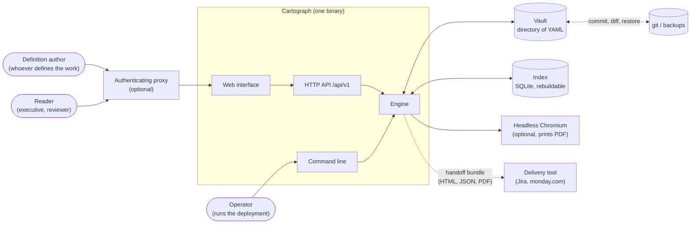
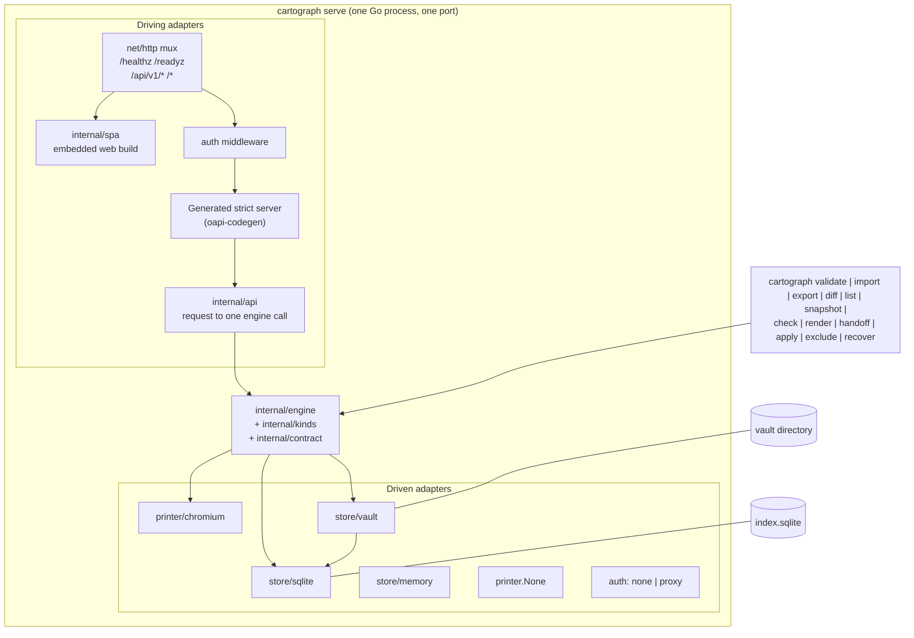
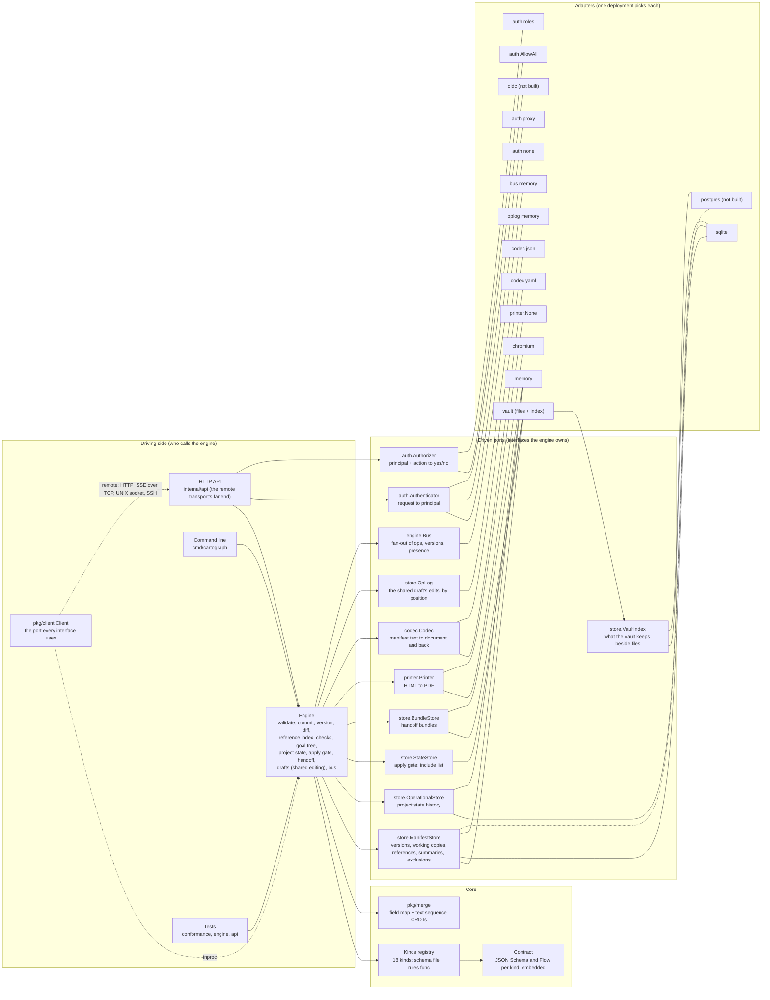
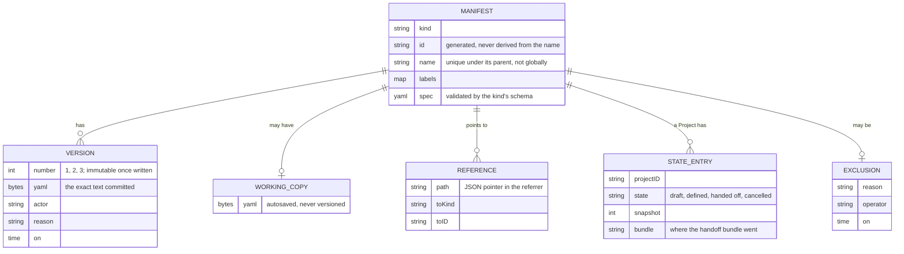
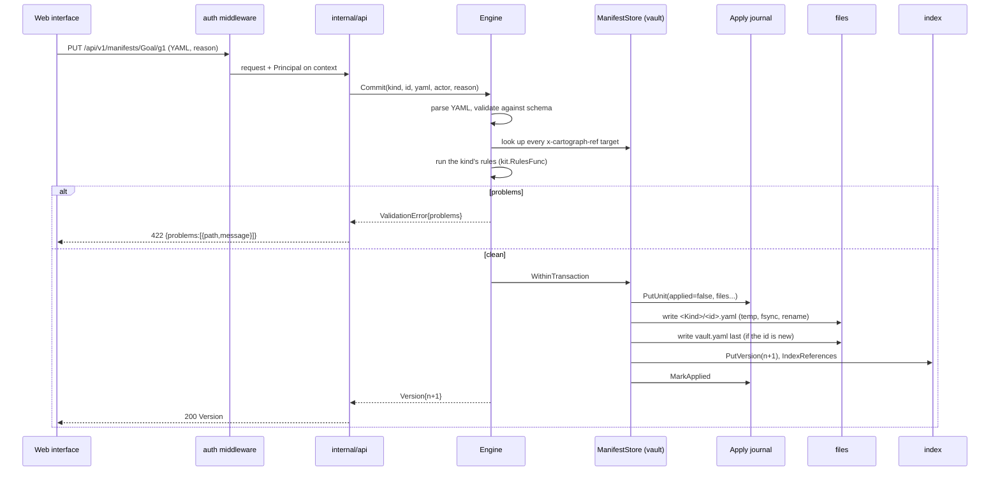
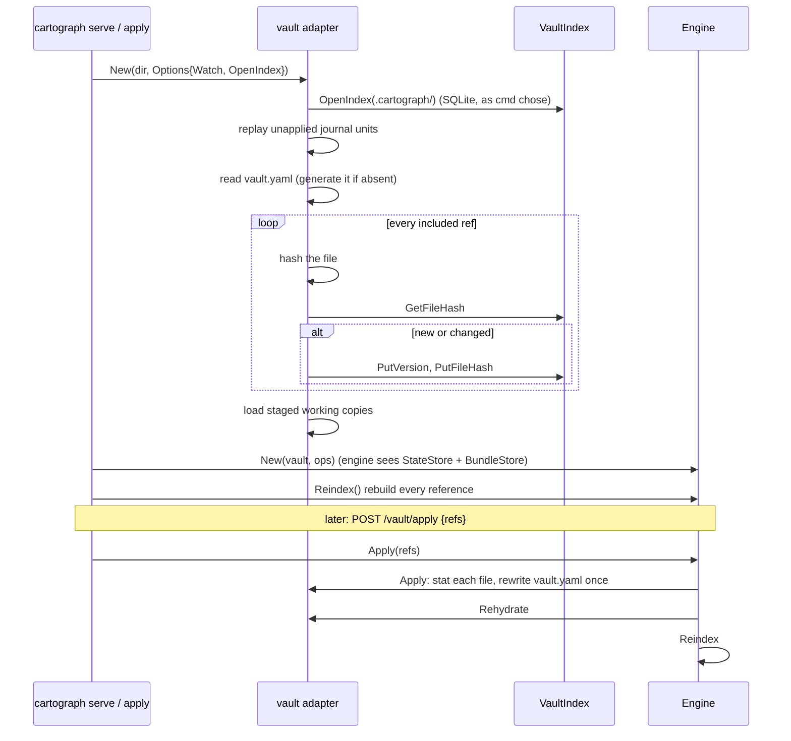
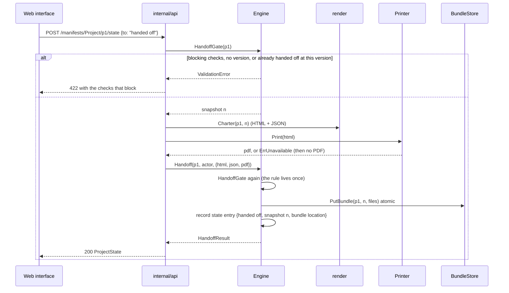
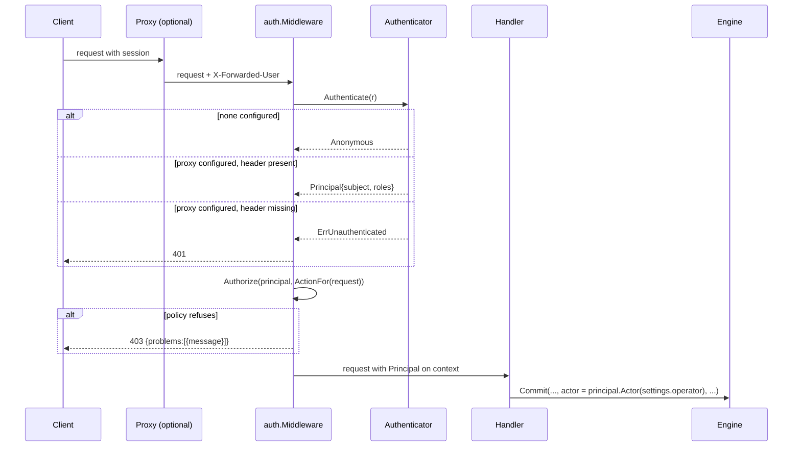
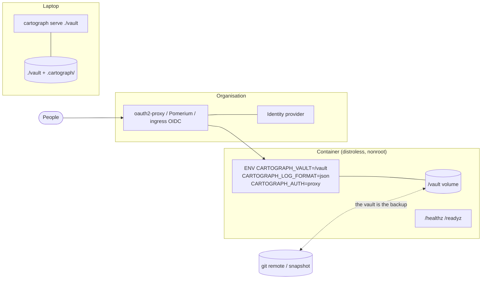

# Cartograph systems architecture

**Describes the tree as built. Where it describes a port with one
adapter, that is the state of things, not a promise. The decisions
behind it are recorded one per file in [`adr/`](adr/README.md).**

Cartograph captures what an organisation has decided to do (goals, programmes,
projects, operations, KPIs, the data sources behind them) as declarative
manifests, checks them against a contract and a set of discipline rules,
and renders the result as documents other tools and people consume.
It does not manage delivery. Jira, or whatever the organisation runs,
does that; Cartograph hands a defined project over and keeps the record.

Three decisions shape everything below.

1. **Contract first.** `contract/openapi.yaml` and one JSON Schema per
   kind are the source of truth. The Go server types and the TypeScript
   client are generated from them and committed; CI fails on drift. No
   handwritten request or response type exists.
2. **The record is the committed text of each version, in whatever
   store the deployment chose.** The engine holds no file path and no
   syntax: a `ManifestStore` adapter keeps the text, a `Codec` adapter
   says what the text is written in. The reference adapter, the vault,
   makes that record a directory of files, one per manifest, plus
   `vault.yaml` saying which are live, so a vault can be read with
   `cat`, diffed with git, and edited in any editor while the server is
   running; its index (versions, references, summaries) is a cache that
   can be deleted and rebuilt. A database adapter keeps the same record
   as rows, and the engine cannot tell the difference. "Files are the
   truth" is the vault's promise, not the architecture's.
3. **One engine, many adapters.** Every rule lives in the Go engine, which
   talks to the world through interfaces (ports). Files, SQLite, a
   browser that prints PDFs, an authenticating proxy: each is an adapter
   a deployment picks by configuration. The HTTP API and the command line
   are two front doors to the same engine; the web interface is a client
   of the API and nothing more.

## 1. Context



The vault is the only thing that needs backing up, and `git` is a fine
way to do it. The index lives beside the vault under `.cartograph/` and is
ignored by version control. The proxy and the browser are optional: a
single operator on a laptop runs `cartograph serve .` and gets everything but
PDF printing and identity.

## 2. Containers

A deployment is one process. The pieces inside it are separable, and the
command line proves it: every subcommand opens the same engine over the
same adapters without an HTTP server in the way.



The web interface is built with Vite in `cartograph-ui` and embedded
into the binary with `go:embed`, so a deployment ships one file. The
engine embeds a released build, not a source tree: `UI_VERSION` names
the release and `UI_SHA256` pins its bytes, and `just ui` and the flake
both unpack exactly that into `internal/spa/dist` before compiling
(ADR 0002). The interface talks only to `/api/v1`, through one HTTP
adapter generated from the same OpenAPI document the server is
generated from, which is how the two halves stay in step.

## 3. The hexagon

The engine depends on nothing but ports. This is the diagram to keep in
mind when adding anything: if a new feature needs the engine to know
about a file path, a SQL dialect or an HTTP header, it needs a port.



A few things the diagram cannot say.

The ports are small and typed on plain values (`[]byte` of YAML, strings,
times). An adapter never sees an engine type, so it can live in another
module tomorrow without the engine noticing.

`StateStore` and `BundleStore` are optional. The engine attaches them when
the manifest store happens to implement them (the vault does) or when the
composition root passes them as options. A store without an apply gate,
such as a database where every row is live, answers `ErrNoState`, and the
API turns that into an empty list or a refusal. That is the whole
difference between "define in YAML" and "define in a database" as far as
the engine is concerned.

The identity ports sit on the driving side on purpose. The engine takes an
actor string and records it on every version and state transition; it
does not know what a session is. Two middlewares wrap the whole API, in
order: `auth.Middleware` turns the request into a `Principal` (or answers
401), and `auth.Authorize` classifies the request into an `Action` (read
or write, and the manifest it names) and puts it to the `Authorizer` (or
answers 403). The handlers never see a credential and never decide
policy; they take the actor off the context. This keeps identity out of
the core and lets a deployment choose "no identity on a trusted network",
"trust the proxy's header, readers and editors by group", or (later)
"verify an OIDC token" without the engine changing.

`codec.Codec` is the one port the engine owns for its own input: manifest
text in, document out, and canonical text back for a save. The engine
parses no syntax itself. YAML is what the vaults are written in; the JSON
adapter proves the seam and is the natural syntax for a database-backed
deployment. A store carries the text its codec produced, byte for byte,
so versions and diffs are over what the person wrote; changing the codec
of an existing vault is therefore a migration (`cartograph export --codec
json`, then serve the export with `CARTOGRAPH_CODEC=json`), never a flag flip
on live files.

`VaultIndex` is the vault adapter's own port, one layer down: the vault is
files plus a rebuildable cache, and that cache is SQLite today and may be
Postgres tomorrow. The engine does not see this port at all, and the
vault does not choose its adapter: the composition root passes an opener
(`vault.Options.OpenIndex`), so the vault and SQLite adapters never
import each other (ADR 0004).

`pkg/client.Client` is the port on the other side: what an interface
(web, terminal, a bot) uses, as a Go interface and never as a wire. In
one process it is the engine (`inproc`); across a process boundary it is
a transport adapter (`remote`: the HTTP contract over TCP or a UNIX
socket, which SSH forwards). The HTTP API in `internal/api` is the far
end of that transport, not something an interface talks to directly.
Both transports are proven by the same conformance suite
(`pkg/uiconformance`), which is how a new transport is admitted.
`UI_CONTRACT.md` and `MULTIPLAYER.md` are the design of record for the
interfaces and for shared editing; `OpLog`, `Bus` and `pkg/merge` are
their engine-side pieces.

### 3.1 Clean architecture, and the test that keeps it

The hexagon above is clean architecture drawn from the side. Read as
rings, from the centre out:

| Ring | Here | May depend on |
|---|---|---|
| Entities | `pkg/merge` (the replicated types), `internal/kinds`, `kinds/<kind>` and `kinds/kit` (what a kind is, its rules), `internal/contract` (the schemas and flows), `internal/sentence` | nothing in the module but each other; no driver |
| Use cases | `internal/engine` | the ports and the entities |
| Ports | `internal/store`, `internal/codec`, `internal/printer`, `engine.Bus` (driven); `pkg/client`, `pkg/uiconformance`, `internal/auth` (driving) | the entities; `internal/auth` also `net/http`, because the identity ports are request middleware |
| Interface adapters | driving: `internal/api`, `internal/render`, `internal/spa`, `pkg/client/inproc`, `pkg/client/remote`, `uiconformance/clientdriver`; driven: `store/vault`, `store/sqlite`, `store/memory`, `codec/yaml`, `codec/json`, `printer/chromium`, `auth/proxy`, `auth/roles`, and the helpers they share (`yamlfmt`, `store/manifestmeta`) | the rings inside them, never another adapter of their side |
| Frameworks and drivers | `net/http`, `database/sql`, `os/exec`, `modernc.org/sqlite`, `fsnotify`, `yaml.v3`, Chromium, the generated server (`api/gen`) | used only by adapters |
| Composition root | `cmd/cartograph`, `internal/config` | everything; the one place an adapter is chosen |

The dependency rule, dependencies point inward, is a test
(`internal/arch`, run by `just arch` and in the gate). Every package in
the module has a rule there, and a new package without one fails the
build, so nothing joins the tree without somebody saying which ring it
belongs to. Each rule lists what that package must never depend on,
transitively: module packages by subtree, third-party drivers by
module path, and standard-library drivers (`net/http`, `database/sql`,
`os/exec`) by name. The engine may not import an adapter, a driver, or
a syntax library; a port may not import the engine; an adapter may not
import another adapter, because composing adapters is the root's job;
`pkg/merge` may not import anything in the module; `cmd` is the only
package that knows everything, which is what makes it the one place an
adapter is chosen. A change that needs a new edge gets a new port, not
an exception (ADR 0003).

### 3.2 Packages

| Package | Role | Depends on |
|---|---|---|
| `internal/contract` | The JSON Schema and flow files, embedded; the schema set | nothing |
| `internal/sentence` | Composes the sentences a manifest stores in parts, the same way everywhere they are shown | nothing |
| `internal/kinds`, `internal/kinds/<kind>` | The registry of kinds and each kind's rules beyond its schema | `kinds/kit` |
| `internal/kinds/kit` | The small types rules need (`Problem`, `Lookup`) so kind packages never import the engine | nothing |
| `internal/engine` | The core: validation, commits, versions, diffs, references, checks, state, apply gate, handoff, drafts (shared editing over the op log), the event bus | `store`, `codec`, `kinds`, `kinds/kit`, `contract`, `sentence`, `merge`; a JSON Schema validator |
| `internal/store` | The port definitions and the record shapes | `merge` |
| `internal/store/vault` | Files are the truth; journalled writes; watcher; apply gate; bundles. Its index is a `store.VaultIndex` the root opens for it | `store`, `store/manifestmeta`, `yamlfmt`, `fsnotify`, `yaml.v3` |
| `internal/store/sqlite` | SQLite adapter: manifest store, operational store, journal, vault index | `store`, `store/manifestmeta`, `modernc.org/sqlite` |
| `internal/store/memory` | In-memory adapter for tests and the conformance suite | `store`, `store/manifestmeta` |
| `internal/store/manifestmeta` | Reads the envelope (kind, id, name, labels) from manifest text for the store adapters | `yaml.v3` |
| `internal/store/conformance` | The one suite every adapter of a port must pass | `store` |
| `internal/codec`, `codec/yaml`, `codec/json`, `codec/conformance` | Manifest syntax port, its two adapters, and the suite both pass | nothing / `codec`, `yamlfmt`, `yaml.v3` |
| `internal/yamlfmt` | Canonical YAML output, shared by the YAML codec and the vault | `yaml.v3` |
| `pkg/merge` | The CRDTs under shared editing: the field map (keyed lists, sets) and the text sequence, with hybrid logical clocks | nothing |
| `pkg/client`, `client/inproc`, `client/remote` | The port every interface uses, and its two transports | `merge`; `engine` and `auth` (inproc), `net/http` (remote) |
| `pkg/uiconformance`, `uiconformance/clientdriver` | The interface suite as data, its Go runner, and the reference driver | `client`, `merge` |
| `internal/printer`, `printer/chromium` | PDF port and the headless-browser adapter | nothing / `printer`, `os/exec` |
| `internal/auth`, `auth/proxy`, `auth/roles` | Identity and policy ports, context plumbing, the two middlewares; the proxy-header authenticator and the role policy | `net/http` / `auth` |
| `internal/render` | HTML documents (charters) from engine data; reads through the engine and decodes through its codec | `engine` |
| `internal/api`, `api/gen` | The generated strict server and the thin handlers | `engine`, `store`, `codec`, `auth`, `printer`, `render` |
| `internal/spa` | The embedded web build, a pinned `cartograph-ui` release | `net/http` |
| `internal/config` | Every setting, from environment then flags | nothing |
| `cmd/cartograph` | The composition root and every subcommand | everything above |

Dependency direction is inward: adapters and drivers import the core,
never the reverse. `render` is the one package that imports the engine
and is also called by the API; it reads, it never writes, and it is the
natural seam for a document-rendering port if a second document format
ever appears.

## 4. Data

### 4.1 Manifests and kinds

Every object is a manifest: an envelope (`apiVersion`, `kind`,
`metadata`, `spec`) whose `spec` is validated by its kind's JSON Schema.
A reference to another manifest is a field the schema marks with
`x-cartograph-ref: <Kind>` (or `"*"` for any kind). The engine walks each
kind's schema once at start-up to learn where its references live, so
adding a reference is a schema change, never an engine change.



The 18 kinds, in registry order: Team, ReportingCycle, DataSource,
BeneficiaryGroup, Resource, FundingSource, Segment, Gap, Assumption,
Goal, Unit, KPI, KPIReadings, Programme, Operation, Project,
StakeholderMap, Settings. There is no Person kind and no Portfolio kind;
docs/TAXONOMY.md` says why,
and that file is the place to argue before adding a kind.

### 4.2 The vault on disk (the reference store)

```
my-vault/
  vault.yaml                 the state manifest: which refs are live
  Goal/raise-produce-quality.yaml
  Project/quality-check-rollout.yaml
  <Kind>/<id>.yaml           one manifest per file, the exact bytes committed
  .cartograph/                    ignored by git; delete it and it is rebuilt
    index.sqlite             versions, references, summaries, journal, file hashes
    staging/<Kind>/<id>.yaml working copies: a draft is not a vault file until saved
    handoff/<project>/v<n>/  the charter bundle of each handoff
```

`vault.yaml` is the apply gate. A file can be dropped into `Goal/` by
hand, by a generator (a generator does exactly this), or by `git pull`, and it is invisible until somebody applies it.
The Snapshots screen and `cartograph apply` do that; `cartograph exclude` takes a
manifest out of the live state and keeps the file; `cartograph recover` puts
it back. Deleting a manifest from the interface deletes its file: the
index is a cache and must never hold a fact the files do not.

### 4.3 The vault's index is a cache

On open, the vault hashes every live file, compares against the hashes
the index recorded, and appends a new version for any file that is new or
changed. Then it rebuilds the reference index by walking every schema. A
watcher does the same for files that change while the server runs
(debounced 200 ms). Deleting `.cartograph/` and reopening yields an equivalent
index; version numbers may restart at 1, and that is the one thing a
rebuild loses, which is why `cartograph snapshot` exists for the versions that
matter.

## 5. Flows

### 5.1 A validated write

Every write goes through one path. The API has one handler for `PUT
/manifests/{kind}/{id}`; the command line's `import` calls the same engine
method per file.



Two properties fall out of this. A crash at any point converges on reopen,
because the journal replays units not marked applied (and a unit's files
are idempotent by hash). And the version number is the concurrency
control: an adapter refuses a `PutVersion` whose number is not exactly
current plus one, so two writers cannot both win.

### 5.2 Open, rehydrate, apply



Apply, recover and the watcher all end in rehydrate plus reindex, once per
batch. The reference index is rebuilt whenever the state is loaded, not
only on writes, because files edited while nothing was running carry
references the index has never seen.

### 5.3 Handoff

A handoff is the moment a definition leaves Cartograph for the delivery tool.
The engine owns the gate; the API orchestrates rendering around it.



Checks never block a save. They block a handoff, and only the ones whose
state is `block`; the rest are advice with a link to the step that fixes
them.

### 5.4 A request's identity



An anonymous principal records the vault's `spec.operator` as the actor,
which is what a single-operator vault has always done. An authenticated
one records its subject. The policy is one call for the whole API, before
any handler: `CARTOGRAPH_AUTHZ=roles` with `CARTOGRAPH_READ_ROLES` and
`CARTOGRAPH_WRITE_ROLES` is the shipped one, and a policy per kind or per
manifest is another adapter over the same `Action`. Every operation in
the contract declares 401 and 403 for this reason. Nothing in the engine
changed to make any of it true.

## 6. Deployment

Cartograph is built to the twelve-factor shape so the same binary runs on a
laptop, in a container, and behind an organisation's proxy.



| Factor | What Cartograph does |
|---|---|
| Codebase | One repository, one `cartograph` binary, many deployments by environment |
| Dependencies | `go.mod`; `flake.nix` pins the toolchain; the embedded web build is a `cartograph-ui` release pinned by `UI_VERSION` and `UI_SHA256`; the image builds from source |
| Config | `internal/config`: every setting is an `CARTOGRAPH_*` variable (address, vault, codec, authenticator, policy, roles, log format, printer), a flag overrides it. See `DEPLOYMENT.md` |
| Backing services | The vault directory, the index database, the printer and the identity provider are attached resources chosen by configuration |
| Build, release, run | `just ci` builds; the image or `nix build .#cartograph` is the release; `cartograph serve` is the run. Nothing is edited at run time |
| Processes | The engine keeps nothing between requests except through a port; the reference adapters keep state on a volume (the vault and its index). Two replicas against one vault are not arbitrated: run one writer, or deploy the stateless adapters `SERVERLESS.md` plans (Postgres store and op log, object-storage bundles, a bus), after which any replica serves any request and scales to zero |
| Port binding | `CARTOGRAPH_ADDR`; a bare port works for platforms that hand out `PORT` |
| Concurrency | One process per vault; the engine is safe for concurrent requests within it |
| Disposability | SIGTERM drains in-flight requests (`CARTOGRAPH_SHUTDOWN_TIMEOUT`), `/readyz` goes 503 first, the journal makes a kill at any point safe |
| Dev/prod parity | `just` recipes run inside the flake, and the image is built from the same flake; CI runs `just ci` and `nix build` on both architectures |
| Logs | `log/slog` to stdout, text or JSON; health probes are not logged |
| Admin processes | Every admin task is a subcommand of the same binary against the same adapters (`import`, `export`, `apply`, `snapshot`, `render`, `handoff`) |

## 7. Extension points, the Kubernetes way

Kubernetes is extended by replacing a component behind a stable interface
(CSI for storage, CNI for networking, an authentication webhook, a CRD
for a new kind, an admission webhook for a new rule), never by patching
the API server. Cartograph follows that pattern at a smaller scale. Each row
is one thing an organisation may want to change, the interface it swaps,
and what a new implementation must pass.

| Want | Kubernetes analogue | Cartograph port | Today | Add one by |
|---|---|---|---|---|
| A new kind of thing to capture | CRD | `kinds.Spec` (schema file + rules func) | 18 kinds | A schema under `contract/schemas`, a line in `kinds/registry.go`, words in `cartograph-ui's src/copy.ts`; the engine does not change |
| A rule beyond the schema | Admission webhook | `kit.RulesFunc` | per-kind packages | A function `(doc, RuleContext) []Problem`; cross-kind lookups through `kit.Lookup` |
| Manifests somewhere other than files | CSI driver | `store.ManifestStore` | vault, sqlite, memory | An adapter that passes `conformance.RunManifestStore`; wire it in `cmd/cartograph/store.go` |
| The index in Postgres (many replicas, one database) | etcd backend | `store.VaultIndex` | sqlite | An adapter that passes `conformance.RunVaultIndex`; pass its opener as `vault.Options.OpenIndex` in `cmd/cartograph/store.go` |
| Define projects in a database, not YAML | Different storage class | `store.ManifestStore` without `StateStore` | sqlite does this already | A Postgres `ManifestStore`; the API is the only write path; the apply gate simply reports `ErrNoState` |
| Write manifests in another syntax | Serialisation (JSON/protobuf at the API server) | `codec.Codec` | yaml, json | An adapter that passes `codec/conformance.Run`; select it by `CARTOGRAPH_CODEC`; migrate a vault with `cartograph export --codec` |
| Authentication | Authn webhook, OIDC | `auth.Authenticator` | none, proxy | An adapter that returns a `Principal`; select it by `CARTOGRAPH_AUTH` |
| User types and permissions | RBAC, authz webhook | `auth.Authorizer` | AllowAll, roles | An adapter over `(Principal, Action)`; enforced once for the whole API by `auth.Authorize`; select it by `CARTOGRAPH_AUTHZ` |
| PDF without Chromium | Container runtime (CRI) | `printer.Printer` | chromium, none | An adapter over `Print(ctx, html)` |
| Handoff bundles in object storage | Volume plugin | `store.BundleStore` | vault, memory | An adapter over `PutBundle`; the state entry records the location it returns |
| A new interface (terminal, native, bot) | kubectl, the dashboard: clients of the API | `pkg/client.Client` + the `Driver` protocol | web (on the port; flows still hand-coded), reference driver | Build on the client port, write a driver, pass `pkg/uiconformance` in your own CI (`UI_CONTRACT.md`) |
| Another transport (socket, SSH, broker) | API server transports | `pkg/client.Client` as an adapter | inproc, remote (HTTP over TCP or UNIX socket) | Implement the port, pass the same suite with the reference driver |
| Shared drafts across replicas | etcd watch | `store.OpLog`, `engine.Bus` | memory | A SQLite or Postgres op log passing `RunOpLog`; a bus over LISTEN/NOTIFY or a broker |

The pattern for every row is the same three steps. Write the adapter in
its own package under the port's directory. Make it pass the port's
conformance suite, which is how the SQLite and memory adapters are proven
interchangeable today. Pick it in `cmd/cartograph` from a configuration value.
No step touches the engine, the contract or the web interface.

What this is not: a plugin system that loads code at run time. An adapter
is compiled in and selected by configuration, as the Kubernetes in-tree
providers were. Out-of-process adapters (a gRPC `ManifestStore`, say) are
possible behind the same interfaces and are not planned until somebody
needs one.

## 8. Decisions and their reasons

The reasons in brief. Decisions made since the first release, with the
options weighed and what they cost, are in [`adr/`](adr/README.md).

**Why files, and not a database, as the truth.** Because the people who
own the content are not database administrators, and a directory of YAML
survives every tool choice. It can be reviewed in a pull request, restored
from any backup, generated by a script, and read without Cartograph running.
The cost is that concurrent writers to one directory need arbitration,
which the journal provides within one process and nothing provides across
processes yet. The Postgres index is the answer when that day comes.

**Why the engine knows no file path and no HTTP header.** So the same
rules run in every front door and in every test. The handoff gate is one
function; the API, the command line and the tests call it. An engine that
read `vault.yaml` itself would make a database-backed deployment
impossible without a fork.

**Why generated code is committed.** So a fresh checkout builds without
running generators, so a reviewer sees what a contract change does to the
Go and TypeScript types, and so CI can refuse drift with one `git diff`.

**Why one binary.** Deployment is copying a file. The web interface
cannot be out of step with its API because they ship together. The
command line is the API's twin, which is what makes scripts and the
interface agree. The interface's build is the one input a fresh
checkout does not carry: it is a pinned, checksummed `cartograph-ui`
release that `just ui` fetches (every recipe that compiles runs it), not
committed output (ADR 0002).

**Why identity is a middleware concern.** A version records an actor
string. Everything above that line (sessions, tokens, groups) varies by
organisation and must not leak into the rules. The proxy adapter exists
because every organisation already has an authenticating proxy or can run
one; an OIDC adapter is a contained addition.

**Why checks never block a save.** Half-finished work is the normal state
of a definition. A check that refused the save would push people back to
Word. Checks block the handoff, where incompleteness has a cost.

## 9. What is not built yet

In rough order of expected need.

- A Postgres `VaultIndex` adapter, then a Postgres `ManifestStore`, each
  proven by the conformance suite. Needed for more than one replica.
- An OIDC `Authenticator`, for deployments without a proxy.
- A finer `Authorizer` (per kind, per manifest, per state transition)
  once an organisation needs one; the shipped roles policy is read or
  write for the whole API.
- The ops and events endpoints of the HTTP transport, the SQLite op log,
  presence, and the terminal interface (`UI_CONTRACT.md`,
  `MULTIPLAYER.md`).
- A document-rendering port, if a second output format joins HTML, JSON
  and PDF.
- Out-of-process adapters, if an organisation needs to write one in
  another language.

Related reading: `DEPLOYMENT.md` (running it), `SERVERLESS.md`
(stateless operation and the plan), `EXTENDING.md` (adding to it),
`../README.md` (building it), `DESIGN_RULES.md` (how it behaves),
`TAXONOMY.md` (what the nouns mean), and `adr/` (each decision, with
what it cost).
