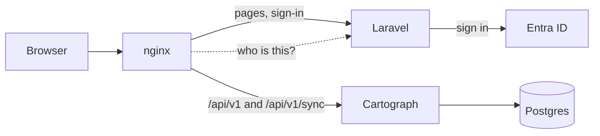

# Shipping a distribution

A distribution is Cartograph packaged for one kind of organisation, with
your sign-in, your interface, your store and your reports. You don't
fork Cartograph to make one. You pin a release, configure it, and build
whatever else you need against the published contract.

Most of the work is sign-in. The rest is configuration and pages you
already know how to write.

`cartograph-oidc` is one distribution. It puts the stock interface
behind Dex and oauth2-proxy. This guide builds another, with its own
interface in Laravel and sign-in through Microsoft Entra ID.

## The rules

1. Pin a release. Use `ghcr.io/projectcartograph/cartograph:<version>`
   or the chart at that version, and upgrade on purpose, one release at a
   time. `VERSIONING.md` says what a release promises.
2. Talk to the contract, never the database. The API is
   `contract/openapi.yaml`, served under `/api/v1`. Reports come from the
   reports endpoint or the reporting views, not from the tables.
3. Let only your proxy reach Cartograph. Cartograph trusts the identity
   headers it is sent, so anything that can reach it directly can claim
   to be anyone.
4. Change Cartograph upstream. If your distribution needs something
   Cartograph doesn't do, propose it to the engine rather than patching
   around it. A patch you carry is a patch you rebase every release.

## What you can replace

| You want | You change | Cartograph setting |
|---|---|---|
| Your own sign-in | A proxy that sets four headers | `CARTOGRAPH_AUTH=proxy` |
| Roles and teams from your directory | A mapping file | `CARTOGRAPH_AUTHZ=access`, `CARTOGRAPH_ACCESS_FILE` |
| Your own interface | Pages that call `/api/v1` | none |
| Live editing in your interface | An automerge-repo client on `/api/v1/sync` | none |
| A database that scales out | Postgres | `CARTOGRAPH_STORE` |
| Reports in your warehouse | Read the event log, or turn reports off | `CARTOGRAPH_REPORTS` |

The four headers:

| Header | Holds |
|---|---|
| `X-Forwarded-Email` | The person's address. The access list knows people by it. |
| `X-Forwarded-User` | The subject. Set `CARTOGRAPH_AUTH_PROXY_HEADER=X-Forwarded-Email` to use the address as the subject too. |
| `X-Forwarded-Groups` | Their groups, comma-separated. |
| `X-Forwarded-Preferred-Username` | Their display name, which others see on a shared screen. |

## Example: a Laravel interface with Entra ID



nginx sits in front of both. Laravel serves the pages and signs people
in. For every `/api/v1` request, nginx asks Laravel who the person is and
passes the answer to Cartograph as headers. The browser calls the API on
the same origin, so the Laravel session cookie is all it needs.

Why nginx and not a proxy route in Laravel? Live editing holds a
WebSocket open for as long as someone has a page open. PHP is bad at
that and nginx is good at it. So PHP answers one question, who is this,
and nginx carries everything else, the socket included.

### 1. Run Cartograph

```
CARTOGRAPH_STORE=postgres://cartograph:...@db:5432/cartograph
CARTOGRAPH_AUTH=proxy
CARTOGRAPH_AUTH_PROXY_HEADER=X-Forwarded-Email
CARTOGRAPH_AUTHZ=access
CARTOGRAPH_ACCESS_FILE=/config/access.yaml
```

Publish no port for it. Only nginx reaches it, on a private network.

### 2. Register the app in Entra ID

In the Entra admin centre, under App registrations, register a new
application:

- Redirect URI (Web): `https://cartograph.example.org/auth/callback`
- Under Certificates and secrets, add a client secret.
- Under API permissions, add the Microsoft Graph delegated permissions
  `User.Read` and `GroupMember.Read.All`, then grant admin consent.

### 3. Sign in with Socialite

```
composer require socialiteproviders/microsoft-azure
```

`config/services.php`:

```php
'azure' => [
    'client_id' => env('AZURE_CLIENT_ID'),
    'client_secret' => env('AZURE_CLIENT_SECRET'),
    'redirect' => env('AZURE_REDIRECT_URI'),
    'tenant' => env('AZURE_TENANT_ID'),
],
```

Register the provider as the package's README shows. Then the two
routes:

```php
use Illuminate\Support\Facades\Http;
use Laravel\Socialite\Facades\Socialite;

Route::get('/auth/login', fn () => Socialite::driver('azure')
    ->scopes(['GroupMember.Read.All'])
    ->redirect());

Route::get('/auth/callback', function () {
    $user = Socialite::driver('azure')->user();

    // Every group the person is in, nested groups included.
    $groups = [];
    $url = 'https://graph.microsoft.com/v1.0/me/transitiveMemberOf/microsoft.graph.group?$select=displayName';
    while ($url) {
        $page = Http::withToken($user->token)->get($url)->throw()->json();
        foreach ($page['value'] as $group) {
            $groups[] = $group['displayName'];
        }
        $url = $page['@odata.nextLink'] ?? null;
    }

    session([
        'cartograph.email' => strtolower($user->getEmail()),
        'cartograph.name' => $user->getName(),
        'cartograph.groups' => $groups,
    ]);
    return redirect('/');
});
```

### 4. Answer "who is this?"

nginx calls this route on every API request. It returns 200 with the
headers, or 401.

```php
Route::get('/auth/check', function () {
    $email = session('cartograph.email');
    if (! $email) {
        return response('', 401);
    }
    return response('', 200, [
        'X-Forwarded-Email' => $email,
        'X-Forwarded-Groups' => implode(',', session('cartograph.groups', [])),
        'X-Forwarded-Preferred-Username' => session('cartograph.name', ''),
    ]);
});
```

A group name that contains a comma would split in two. Rename the group,
or send group IDs and map the IDs in step 6.

### 5. Put nginx in front

```nginx
map $http_upgrade $connection_upgrade { default upgrade; '' close; }

server {
    listen 443 ssl;
    server_name cartograph.example.org;

    # Ask Laravel who the person is.
    location = /_who {
        internal;
        proxy_pass http://laravel/auth/check;
        proxy_pass_request_body off;
        proxy_set_header Content-Length "";
        proxy_set_header Cookie $http_cookie;
    }

    # Cartograph's API and live editing, with the answer as headers.
    # proxy_set_header replaces whatever the browser sent, so nobody can
    # forge them.
    location /api/v1/ {
        auth_request /_who;
        auth_request_set $email  $upstream_http_x_forwarded_email;
        auth_request_set $groups $upstream_http_x_forwarded_groups;
        auth_request_set $name   $upstream_http_x_forwarded_preferred_username;
        proxy_set_header X-Forwarded-Email $email;
        proxy_set_header X-Forwarded-User $email;
        proxy_set_header X-Forwarded-Groups $groups;
        proxy_set_header X-Forwarded-Preferred-Username $name;

        proxy_http_version 1.1;
        proxy_set_header Upgrade $http_upgrade;
        proxy_set_header Connection $connection_upgrade;
        proxy_read_timeout 3600s;
        proxy_pass http://cartograph:8080;
    }

    # Everything else is Laravel.
    location / {
        proxy_pass http://laravel;
    }
}
```

### 6. Map groups to roles and teams

`access.yaml`, using the group names from step 3:

```yaml
roles:
  reader: [All staff]
  contributor: [Curriculum division, Early grades]
  strategyEditor: [Planning]
  administrator: [Cartograph administrators]
teams:
  - group: Curriculum division
    name: Curriculum division
  - group: Early grades
    name: Early grades
    parent: Curriculum division
```

Create the teams once per deployment, before the replicas start:

```
cartograph access apply /config/access.yaml -store "$CARTOGRAPH_STORE"
```

People whose groups grant a role are added to the access list the first
time they sign in. `DEPLOYMENT.md`, "Access by role and team", has the
details.

### 7. Build your pages on the contract

Your pages call the API from the browser:

```js
const res = await fetch('/api/v1/manifests/Project?limit=50');
const page = await res.json(); // { items: [...], next }
```

Three documents tell an interface everything it needs, so you don't have
to hard-code it:

| Ask for | You get |
|---|---|
| `GET /api/v1/flows/{kind}` | The steps of a kind's editor, and the fields in each |
| `GET /api/v1/schemas/{kind}` | Each field's type, allowed values and what it refers to |
| `GET /api/v1/session` | Who is signed in, their roles, and what they may change |

Some rules every interface keeps (`UI_CONTRACT.md`):

- A save that fails returns problems, each with a field path. Show each
  problem on its field.
- A check never blocks a save. Only handing a project off does.
- Disable what `session.access` says the person may not change, and say
  why.
- Record one KPI reading with
  `POST /api/v1/manifests/KPIReadings/{id}/series/readings`. It costs
  the same however long the series is.

If you'd rather call the API from PHP, give Laravel the same identity
headers on a private network and use `Http::withHeaders(...)`. Generate a
client from `contract/openapi.yaml` if you want types.

### 8. Live editing (optional)

Shared drafts speak the automerge-repo protocol on `/api/v1/sync`. In
your pages, use `@automerge/automerge-repo` with its WebSocket client
adapter, pointed at `wss://cartograph.example.org/api/v1/sync`. The
stock interface's `src/client/live.ts` in `cartograph-ui` is a working
example, and `MULTIPLAYER.md` covers the document shape and presence.

Close the socket when nobody is at the page, or a forgotten tab keeps a
replica running and the deployment never scales to zero. The stock
interface's `src/client/attention.ts` does it in about a hundred lines:
the page hidden for a minute, or two minutes without input, and it calls
the adapter's `disconnect()`; the next input calls `connect()` again
(ADR 0015).

### 9. Prove it

The interface suite in `pkg/uiconformance` is a set of JSON scenarios.
Each one opens an editor, sets fields by path, saves, and expects
problems on particular fields. Write a driver that runs your pages
(Laravel Dusk can drive them), run the scenarios in CI against a copy of
`examples/minimal`, and keep them passing as you upgrade. They are the
cheapest way to find out a release changed something you relied on.

### 10. Ship it

- Pin every version: Cartograph, Postgres, nginx, your app.
- Deploy with Cartograph's chart, adding your Laravel and nginx
  Deployments, or with Compose.
- Keep Cartograph's Service private, with a NetworkPolicy that admits
  only nginx.
- Before people arrive, sign in as an administrator, as a contributor
  and as someone in no mapped group, and check what each one can do.
  `cartograph-oidc/scripts/e2e.py` does this for its distribution and
  is a good template.

## Agents


An interface of your own shows people the guidance agents read:
`GET /api/v1/guides/{kind}` gives each field's words with right and
wrong examples, and the words an editor may offer, in the person's
language where the engine has it (ADR 0017). Show proposals on a review
page (`GET /api/v1/proposals/{id}`), and accept only from there. To let
people follow their agents, open `GET /api/v1/agents/feed` on the sync
socket and read the `agent` block of its presence (ADR 0018).
Agents connect over MCP. Each acts for one person, with that person's
access; it reads and proposes, and its person decides (ADR 0016). Turn
them on with `CARTOGRAPH_MCP=on` and name the roles allowed them in the
mapping (`agents: [contributor]`).

A person adds `https://cartograph.example.org/api/v1/mcp` to their
client, a browser opens, they sign in and click Allow. Something has to
run that flow, an OAuth authorization server, and you have two choices.

### Laravel runs it

If Laravel is your whole stack, make it the authorization server too.
Cartograph then trusts Laravel's answer to "who is this?", as it does
for a browser, and keeps nothing about tokens.

Install Passport and Laravel MCP, publish Laravel MCP's consent view,
and register its OAuth routes, which add client registration and the
discovery documents (see Laravel's MCP documentation, "OAuth
authentication"):

```php
// routes/ai.php
use Laravel\Mcp\Facades\Mcp;

Mcp::oauthRoutes();
```

Keep each person's groups on their user at sign-in, so a token can
answer for them later. In step 3's callback, after the groups loop:

```php
$person = User::updateOrCreate(
    ['email' => strtolower($user->getEmail())],
    ['name' => $user->getName(), 'groups' => $groups],
);
Auth::login($person);
```

Then let step 4's check accept a Passport token when there is no
session:

```php
Route::get('/auth/check', function () {
    if ($email = session('cartograph.email')) {
        return response('', 200, [
            'X-Forwarded-Email' => $email,
            'X-Forwarded-Groups' => implode(',', session('cartograph.groups', [])),
            'X-Forwarded-Preferred-Username' => session('cartograph.name', ''),
        ]);
    }
    // An agent, with a token Laravel issued its person.
    $user = Auth::guard('api')->user();
    if (! $user) {
        return response('', 401);
    }
    return response('', 200, [
        'X-Forwarded-Email' => $user->email,
        'X-Forwarded-Groups' => implode(',', $user->groups ?? []),
        'X-Forwarded-Preferred-Username' => $user->name,
    ]);
});
```

In nginx, pass the token to the check, and answer an agent with no
token the way MCP clients expect, so they know where to sign in:

```nginx
    location = /_who {
        # as before, and:
        proxy_set_header Authorization $http_authorization;
    }

    location = /api/v1/mcp {
        # the same auth_request and headers as /api/v1/, and:
        error_page 401 = @mcp_sign_in;
        proxy_pass http://cartograph:8080;
    }

    location @mcp_sign_in {
        add_header WWW-Authenticate 'Bearer resource_metadata="https://cartograph.example.org/.well-known/oauth-protected-resource/api/v1/mcp"' always;
        return 401;
    }

    # Cartograph says where agents sign in: at Laravel.
    location ^~ /.well-known/oauth-protected-resource {
        proxy_pass http://cartograph:8080;
    }
```

And tell Cartograph where that is:

```sh
CARTOGRAPH_MCP=on
CARTOGRAPH_MCP_AUTH=proxy
CARTOGRAPH_MCP_ISSUER=https://cartograph.example.org
```

The person's consent, their list of connected agents and revoking them
are Laravel's, on Laravel's pages. What an agent may do once connected
is Cartograph's, the same either way.

### Cartograph runs it

If you would rather not run an authorization server, let Cartograph be
one (`CARTOGRAPH_MCP_AUTH=cartograph`). Its consent page sits behind
your nginx check like any page, so people still sign in through Laravel
and Entra ID. Send these paths to Cartograph without the check, since
Cartograph checks their tokens itself:

```nginx
    location ~ ^/(api/v1/mcp|oauth/register|oauth/token|\.well-known/oauth-) {
        proxy_pass http://cartograph:8080;
    }
```

and `/oauth/authorize` to Cartograph with the check, as `/api/v1/` is.
`docs/DEPLOYMENT.md`, "How an agent signs in", has the settings. Connected
agents are then listed on Cartograph's Access page, in your interface if
it uses the `/agents` API.

## Reports and warehouses

`CARTOGRAPH_REPORTS=computed` (the default) serves four reports at
`/api/v1/reports/{name}` on any store. `postgres` serves them as SQL
views in the same database, for BI tools. If you have a warehouse, set
`off` and load it from the event log, which lists every save, state
change and reading in order (ADR 0013, ADR 0014). The API serves the log
from the next release. Until then, on Postgres, read the `events` table,
the one table meant to be read from outside. Follow `seq` as a cursor,
and take only events older than every open transaction, so one that
commits late is never skipped:

```sql
SELECT * FROM events
WHERE seq > $1 AND tx < pg_snapshot_xmin(pg_current_snapshot())
ORDER BY seq LIMIT 1000;
```
