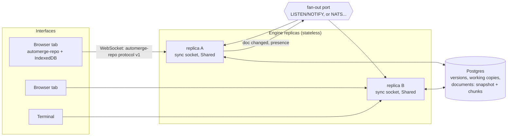

# Collaboration: CRDTs, sync and presence

Design of record for shared editing, from engine 2.0.0. The decisions
are ADR 0007 (Automerge is the one CRDT) and ADR 0008 (Postgres holds
the state; fan-out is a port). This page says how it works.

People define work together. Several of them open the same project at
once, from browsers and terminals, connected to any replica of the
engine, sometimes over a connection that drops. Each sees the others'
edits as they happen, and where the others are on the screen. Each keeps
working while disconnected, and everyone ends with the same document
without anyone deciding whose edit counts. Nobody needs a shared screen
or a projector to work on one definition together.

## 1. Requirements, in the terms the field uses

- Optimistic replication: every participant edits a local replica at
  once, with no round trip and no lock, and changes propagate
  afterwards.
- Strong eventual consistency: any two replicas that have received
  the same set of changes hold the same document, whatever order the
  changes arrived in and however often. No coordinator and no
  consensus round is needed.
- Partition tolerance: a network partition (a laptop offline, a
  replica cut off from the database's notifications, a whole region
  away) loses no edit. When the partition heals, the replicas exchange
  what the others lack and converge.
- Stateless engine processes: following the twelve-factor process model,
  a replica keeps nothing a later request needs. Any replica serves any
  request, a replica can be killed at any moment, and the deployment
  scales out and in without coordination (`SERVERLESS.md`).
- Presence: each person sees who else is on the same screen, which
  field they are in, their caret, and their pointer.

Conflict-free replicated data types (CRDTs) are the standard answer to
the first three ([crdt.tech](https://crdt.tech) collects the
literature). Cartograph uses [Automerge](https://automerge.org), the
CRDT library from Kleppmann, Beresford and Ink & Switch, in the engine
and in every interface.

## 2. What is shared, and what is recorded

There are two things, and the line between them is the same as before
2.0.

- A *version* is immutable, numbered and attributed. It is what
  `diff`, `export`, the charter and the handoff read. Saving one is a
  decision a person makes, with a reason, and it is validated.
- The *shared draft* is everything between versions: one Automerge
  document per manifest, which everyone edits at once. The engine
  materialises it into the manifest's working copy, so everything that
  reads working copies keeps working.

Saving a version reads the draft. It does not reset it. The draft
carries on across versions, so an edit made offline before a version
was saved still merges after it.

## 3. The CRDT, and the standard patterns it uses

An Automerge document is a JSON-like tree of maps, lists, text and
scalars, replicated as a history of changes.

Every edit is a *change*: a set of operations, stamped with the editing
replica's *actor id* and a sequence number for that actor. It names the
changes it builds on (its dependencies) and is identified by the hash of
its contents. The changes form a hash-linked directed acyclic graph, as
commits do in git. The *heads* are the changes nothing depends on yet,
and equal heads mean equal documents. Because a change is identified by
its hash, receiving it twice changes nothing (idempotence). Because a
change waits until its dependencies have arrived, the order of arrival
does not matter (causal delivery is enforced at the receiver). Those two
properties make delivery over an unreliable network safe.

Operation ids are Lamport timestamps. Every operation has an id
made of a counter and the actor (`counter@actor`). The counter is
higher than any counter the actor had seen when it made the operation,
which is Lamport's logical clock. These ids give a total order that is
consistent with causality. Every tie-break in the document uses that
order, so every replica breaks every tie the same way.

Maps are multi-value registers. When two replicas set one key
concurrently, both values are kept. The one with the greater operation
id is shown, and the others remain as *conflicts* until somebody sets
the key again (Shapiro, Preguiça, Baquero and Zawirski, 2011, describe
the multi-value register). A conflict is not an error. It is the
literal record that two people chose differently, and Cartograph shows
it to them (section 5).

Lists and text are sequences in the RGA family (Roh, Jeon, Kim and
Lee, 2011, the Replicated Growable Array). Every element has the id of
the operation that inserted it and is placed after the element it was
typed after. Concurrent insertions at one place are ordered by
operation id, and a deleted element stays as a tombstone, so later
insertions that refer to it still find their place. Two people typing
in one sentence both keep their words. An edit inside a list item that
someone else deleted does not bring a fragment of it back, because the
item, not its fields, is what the list holds. Kleppmann and Beresford
(2017, "A Conflict-Free Replicated JSON Datatype") give the composition
of maps and lists that Automerge's document model follows.

A position in a text or a list (a cursor) is held as the id of the
element it is next to, not as an index. It therefore stays on the same
character while others insert before it. Presence carets use these.

Two replicas reconcile with Automerge's sync protocol, which follows
Kleppmann and Howard (2020, "Byzantine Eventual Consistency and the
Fundamental Limits of Peer-to-Peer Databases"). Each side sends its
heads and a Bloom filter of the changes it added since the last
exchange. From those each side works out what the other is missing and
sends it, usually in one round trip. What a side remembers about a peer
(the sync state) only saves work. A fresh sync state starts from heads
and arrives at the same place, which is why a replica can forget it.

A document saves as a compressed, columnar encoding of its whole history
(a snapshot), or as the changes since the last save (an incremental
chunk). Loading a snapshot followed by chunks in any order reproduces
the document.

## 4. Manifests as documents

A manifest is a form, not a free-form document, and the engine maps it
onto Automerge with a *shape* read from the kind's schema
(`Engine.Shape`), so engine and interfaces agree without either deciding
it by hand:

- A list of objects is keyed by `x-cartograph-list-key`, or by `id` when
  its items have one. When a whole document is folded into the draft,
  items are matched by key, so an item keeps its identity and the edits
  inside it. A reordered item is deleted and re-inserted, because
  Automerge has no move operation (Kleppmann, 2020, "Moving Elements in
  List CRDTs", describes one). An edit made inside an item at the same
  moment someone moves that item can therefore be lost. Keyed lists in a
  form are rarely reordered, and this cost is accepted.
- A string is a text, merged character by character, when the schema
  leaves it as free prose: no `enum`, `const`, `format`, `pattern` or
  `x-cartograph-ref`. Every other string (an id, a reference, a date, a
  choice) is a scalar, so concurrent writes become a conflict rather
  than an id nobody wrote. Interfaces read which a field is from the
  document itself.
- Every write that is not a sync message (`PUT .../working`, an import,
  a file changed in a vault, a discarded draft) arrives as a whole
  document. The engine reconciles it into the draft as one change, the
  smallest diff from the current state: objects key by key, keyed lists
  by key, unkeyed lists by position, and texts by splice
  (`update_text`), never by replacement. Every path into a draft ends in
  the same document.
- A manifest's document is made on first use from its working copy or
  current version, then stored with `DocStore.Create`, which is atomic.
  If two replicas make it at the same moment, one wins and the other
  loads the winner's before serving anything. Actors are always random.

## 5. Conflicts are notes, never refusals

A field holding concurrent values is listed by `Shared.Conflicts`,
which reads the document's conflicts on demand. No replica keeps a list
of them. Interfaces show each one at its field as a note: the value
shown, the other value, and one action to choose it instead. Choosing
is an ordinary edit, which resolves the conflict for everyone. Texts
never raise one, because they merge. This follows `DESIGN_RULES.md`. A
check never blocks a save, and neither does a disagreement.

## 6. The engine as a peer

- The sync socket (`internal/syncserver`, `GET /api/v1/sync`)
  speaks the automerge-repo network protocol, version 1: CBOR messages
  over a WebSocket, `join` and `peer` to start, then `request`, `sync`,
  `doc-unavailable` and `ephemeral`. The stock
  `@automerge/automerge-repo` WebSocket adapter connects to it
  unchanged. Nothing on the wire is Cartograph's own.
- The shared-draft service (`engine.Shared`) keeps each document as
  a snapshot plus chunks in the `DocStore`. On every message it first
  folds in the chunks other replicas stored since it last looked. It
  then applies the message, appends the change it produced as a new
  chunk, writes the working copy, and publishes a hint on the fan-out
  port. Every 128 chunks, a replica folds them into a new snapshot.
- Fan-out wakes the other replicas. A replica with peers on a
  document subscribes to its topic. On a hint it offers each of those
  peers whatever they lack. Hints are at most once. Every connection
  also offers each of its documents every 15 seconds, so a lost hint
  costs at most that long, and never an edit.
- Connections stay up, and leave cleanly. The socket pings every
  `CARTOGRAPH_SYNC_PING` (20 s), under common load balancers' idle
  timeouts, and drops a peer that stops answering. A replica shutting
  down sends each peer "going away", and the peer reconnects at once
  to a replica that stays (ADR 0009).
- Permissions are per document. A peer may open a document only if
  the authorizer lets the principal read its manifest. A sync message
  from a principal who may not write is tried on a copy first; if it
  would change anything it is refused and the connection closes. The
  presence document (section 8) takes no changes from anyone.

## 7. Failure and partition, case by case

| What happens | What the system does | What is lost |
|---|---|---|
| A browser goes offline and keeps editing | Edits go to its local replica and IndexedDB. On reconnect the sync protocol sends them and fetches what it missed | Nothing |
| A version is saved while someone is offline | The draft carries on. Their edits merge into it on reconnect and show in the next version | Nothing |
| A replica is killed mid-request | The client reconnects to any replica, which loads the document from the store and syncs from heads. A change the dead replica had accepted but not stored was not acknowledged, and the client still holds it and sends it again | Nothing |
| A fan-out hint is lost, or the notification channel is partitioned | Peers on other replicas get the change at the next periodic offer (15 seconds) or on their own next message | Latency only |
| Two replicas create a manifest's document at once | `DocStore.Create` is atomic; one document stands, and the other replica loads it | Nothing |
| Two people set one scalar field at once | Both values are kept; one shows; a conflict note offers the other | Nothing |
| Two people type in one sentence at once | Both keep their words, in an order every replica agrees on | Nothing |
| The database is unavailable | The engine cannot store changes and refuses them, so clients keep them locally and send them again later | Nothing; availability of the server side only |

## 8. Presence

Presence is ephemeral. It travels as automerge-repo `ephemeral`
messages on the document of the screen a person is on: a manifest's own
document, or the presence document (`GET /presence`) on screens that are
not about one manifest. The engine relays each one to the document's
other peers on this replica, and through the fan-out port to the other
replicas. It never reads, stores or logs them.

The payload is `contract/schemas/presence.schema.json`: the session, the
principal and display name, a colour, the route, the focused field (a
JSON pointer), the caret as two Automerge cursors, and the pointer. The
display name is the one `GET /session` returns, which the authenticator
took from the identity provider (with `auth/proxy`,
`X-Forwarded-Preferred-Username`), so people see each other by the names
their directory gives them. The pointer is held as the element it is
over (a control's `data-cartograph-field`, or a region's
`data-cartograph-region`) with x and y as fractions of that element, so
a pointer lands over the same thing on screens of different sizes. A
session repeats itself every three seconds and on every change (pointer
movement at most twenty times a second), and sends `leaving` when it
closes. Receivers forget a session they have not heard from for ten
seconds. This is the same shape as Yjs's awareness protocol, carried on
automerge-repo's ephemeral channel.

What is drawn is only what is in front of a person. A pointer, a caret
and a focus ring are drawn for the sessions on the same view (the same
route), never for those on another section of the manifest or on
another screen that shares the presence document. Only the page is
shared: a pointer over the rail or any panel beside the page is each
person's own and is not sent. Another section of the same manifest shows
who is on it as a mark on its step, as a spreadsheet marks the tab
someone else is on. Pointer movement, the one stream, is sent only while
someone else is on the same view; alone, a session sends one clearing
message and then only its heartbeat, so a room of people on different
screens costs a heartbeat each, not a pointer each. An agent has no view,
only the field it works on, and is drawn wherever that field is shown.

A session is a browser tab or a terminal, not a person. One principal
may have several. Presence names the authenticated principal of a live
session and ends with it. It is not a record of a person, and Cartograph
still has no Person kind (`DESIGN_RULES.md`).

## 9. What each replica holds, and why that is still stateless

| Held in a replica | Why it is only a cache |
|---|---|
| Open documents, keyed by id | Refreshed from the store before every use; dropped when the last peer leaves, and bounded by `CARTOGRAPH_DOC_CACHE` (least recently used go first; a dropped one reloads) |
| A sync state per connection and document | Lives as long as the connection; a new one starts from heads, which is also what happens when a document is reloaded into another module instance |
| Fan-out subscriptions per open document | Re-made on the next connection; hints are only hints |
| Presence in flight | Never stored; the next heartbeat replaces it |

Everything that must outlive a request is in the store: versions,
working copies and documents. With `CARTOGRAPH_STORE=postgres://...`
every replica serves every request. With a vault, the documents live
in the vault's index database beside the files. Delete the index and a
manifest's draft starts again from its working copy, as the vault's
promise ("files are the truth") says it should.

## 10. How it is tested

- `internal/crdt/conformance` runs against the Automerge adapter:
  - save, load and incremental round trips;
  - reconcile idempotence;
  - keyed identity across reorders;
  - delete winning over a concurrent edit inside the item;
  - concurrent typing in one text;
  - conflicts reported identically on every replica;
  - a partition property test. Three to five replicas edit at random
    while a simulated network drops, duplicates and reorders messages
    and splits them into groups, then heals. Every replica must end
    with equal heads, equal JSON and equal conflicts.
- `conformance.RunDocStore` and `internal/fanout/conformance` hold every
  adapter of those ports to the same behaviour, and the Postgres
  adapters run them against a real database in `just test-postgres`.
- A multi-replica test starts two engines on one database, connects a
  peer to each, edits on both, and checks they converge.
- The web interface's tests join two automerge-repo instances over an
  in-memory network. They check that edits through its client port
  converge, and that presence arrives, expires and leaves.

## 11. References

- Shapiro, Preguiça, Baquero, Zawirski. *A comprehensive study of
  Convergent and Commutative Replicated Data Types.* INRIA, 2011.
- Roh, Jeon, Kim, Lee. *Replicated abstract data types: Building blocks
  for collaborative applications.* JPDC, 2011.
- Kleppmann, Beresford. *A Conflict-Free Replicated JSON Datatype.*
  IEEE TPDS, 2017.
- Kleppmann, Howard. *Byzantine Eventual Consistency and the
  Fundamental Limits of Peer-to-Peer Databases.* 2020.
- Kleppmann. *Moving Elements in List CRDTs.* PaPoC, 2020.
- Lamport. *Time, Clocks, and the Ordering of Events in a Distributed
  System.* CACM, 1978.
- Automerge documentation and the automerge-repo WebSocket protocol
  (`packages/automerge-repo-network-websocket/README.md` in the
  automerge-repo repository).
