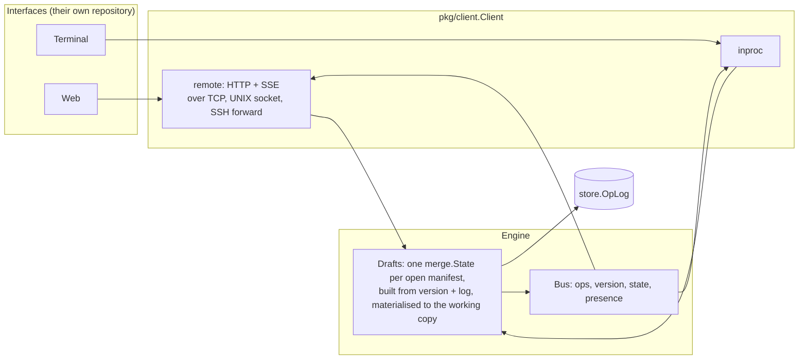

# Multiplayer

**2026-10-01, design of record for increment I5, revised the same day
after the Programme Lead's answers: sentences merge character by
character, transports are adapters. Built: `pkg/merge` (the field map
and the text sequence, with convergence proofs), `store.OpLog` with the
memory adapter and conformance, `engine.Drafts` and `engine.Bus`, the
client port's draft methods over the in-process transport.**

Two people define the same project at the same time, one in a browser
and one in a terminal, perhaps on another machine over SSH. Each sees
the other's edits as they happen, each can save, nobody's work is lost,
two people typing in one sentence both keep their words, and when both
set the same field the later one shows and the earlier one is kept
where its author can see it. This page is how the engine makes that
true, and why this way.

## 1. What is shared, and what is not

Cartograph already distinguishes two things, and multiplayer keeps the line.

- A **version** is immutable, numbered, attributed, and what `diff`,
  `export`, the charter and the handoff read. Saving a version is a
  decision one person makes, with a reason. Nothing here changes that.
- A **working copy** is the draft between versions. It becomes one
  shared draft per manifest, made of many people's edits, converging to
  the same document on every screen, and still materialised into the
  working copy everything else reads today.

The unit of collaboration is the field (and inside a sentence, the
character); the unit of record stays the version.

## 2. The data structure

`pkg/merge` holds two replicated types, both CRDTs: any set of edits,
applied in any order, on any replica, yields the same document.

**The field map.** A last-writer-wins map over the manifest's leaf paths
(Shapiro, Preguica, Baquero, Zawirski, "A comprehensive study of
Convergent and Commutative Replicated Data Types", 2011, the LWW-Map
built from LWW-Registers). Each write is one `Op`: a path, a value or a
delete, a clock, and the clock of the value the writer saw (its base).
Lists of identified items are merged by key, addressed as
`/spec/keyResults/{kr-2}/target`, with a per-item rank for order
(fractional indexing). Lists of values are sets. Which lists are keyed
is the schema's business (`x-cartograph-list-key`, the idea of Kubernetes'
`x-kubernetes-list-map-keys`); the engine reads it (`Engine.Keyer`).

**The text sequence.** A `sentence` field is not one register but a
sequence of characters, each with a unique id and the id of the
character it was typed after: the Replicated Growable Array (Roh, Jeon,
Kim, Lee, "Replicated abstract data types", 2011). Two people editing the
same sentence both keep what they typed, in a deterministic order, on
every replica. An interface with a plain input box does not track
cursors: `Text.Edit(newValue)` turns the box's new value into character
ops (keep the common prefix and suffix, delete the middle, retype it),
which is what a keystroke becomes. The first text op on a scalar leaf
turns it into a text seeded from the string, identically on every
replica; a later plain Set replaces the whole text under the usual
last-writer rule.

Clocks are hybrid logical clocks (Kulkarni, Demirbas, Madappa, Avva,
Leone, "Logical physical clocks", 2014): wall time, a counter within the
millisecond, the actor as the last tiebreak. A replica that receives a
newer clock stamps its next write after it.

The tests prove the properties rather than assert them: 200 random
field ops over 25 random orders converge; 150 random text edits by three
actors over 20 random orders converge with no op left waiting for its
anchor; merge is commutative, associative and idempotent for both types;
decompose then materialise is the identity.

Why not Automerge or Yjs. They are the right general answer and the
wrong fit here: a manifest is a form, the Go binding to Automerge is cgo
over a Rust core (the static image cannot carry it), and a form needs a
map with keyed lists plus a text sequence for a few fields, which is
what was built, in 600 lines, with proofs. If an organisation's
interface already runs Yjs, the ops here translate; the clocks and ids
are the same shape.

## 3. Conflicts are notes, never refusals

Two people set the same field at the same time. The state converges
whichever write arrives first (the later clock holds the field). What
the engine adds is a **Conflict** note: when an op's base is not the
clock of the value it is overwriting and the other writer is a different
actor, the losing value is kept with its author. The interface shows it
as a check item at that field (`state: note`, "Jo changed this while it
was being edited; the earlier value was X") with the earlier value one
action from being restored. Sentences never raise this note: they merge.
This is Kubernetes' server-side apply conflict, turned from a refusal
into a note, because `DESIGN_RULES.md` says a check never blocks a save
and that rule holds here too.

## 4. The engine

- `store.OpLog` (built; memory adapter; `conformance.RunOpLog`): an
  append-only log of ops per manifest with dense sequence numbers.
  Clients catch up by position. Compacted at every version.
- `engine.Drafts` (built): `Open` builds the state from the working copy
  or the current version (`merge.Decompose` with the kind's keyer) plus
  the log; `Edit` applies, appends, publishes, keeps conflict notes and
  materialises the working copy through `PutWorking`; `Since` catches a
  client up; a version save (`Commit`, `CommitProject`, `Snapshot`)
  compacts the log and clears the notes.
- `engine.Bus` (built; in-process adapter): fan-out of `ops`, `version`,
  `state` and `presence` events per manifest. Across replicas the
  Postgres index's `LISTEN/NOTIFY` or a broker is the adapter behind
  the same interface.
- Presence (card I5.3): who has which manifest open and which field,
  ephemeral, on the bus, shown as a mark beside the field.

## 5. Transports

The client port carries `Edit`, `OpsSince` and `Subscribe`. In-process
they are direct calls and a channel. Over HTTP (card I5.2) they are
`POST /manifests/{kind}/{id}/ops`, `GET .../ops?after=N` and
`GET /events` as Server-Sent Events, which every proxy understands and
which reconnects itself with `Last-Event-ID`. The same HTTP runs over a
UNIX domain socket (`CARTOGRAPH_ADDR=unix:///run/cartograph.sock`), so a terminal
interface on the same machine needs no port, and `ssh -L` carries that
socket to another machine. A second user joining a terminal session over
SSH (Charm's `wish` hosts a Bubble Tea program per SSH connection) shares
one in-process client, so the two sessions are two editors of one
draft with no transport between them at all.

A transport that loses its connection keeps editing its local state
and, on reconnect, sends what it wrote and asks for what it missed. The
merge makes that safe; there is no rebase, only merge.

## 6. The scenarios

The conformance suite gains scenarios that drive two drivers against one
engine, in both transports and in any mix: concurrent edits of different
fields converge; two people typing in one sentence both keep their
words; concurrent sets of one field leave the later value and a note on
both screens; a version saved by one is seen by the other; a
disconnected client reconnects and converges. The engine-level versions
of the first three exist today (`drafts_test.go`).

## 7. Open

- Presence detail (manifest and field, or manifest only). The design
  assumes field.
- Whether a version save should warn when another person has unsaved
  ops on the same manifest. The design takes the shared draft as it
  stands, since the draft is one and shared.
- Peer-to-peer between two terminals with no engine between them: the
  CRDT allows it; nothing is planned until somebody needs it.
